```mermaid
graph LR
    A[Write Spec<br/>AUTH-001 MUST] --> B[Generate Contract<br/>feature_auth.yml]
    B --> C[Generate Test<br/>auth.test.ts]
    C --> D[Implement Code<br/>Add authMiddleware]
    D --> E{Run Tests}
    E -->|PASS| F[✅ Merge]
    E -->|FAIL| G[❌ Fix Code]
    G --> D

    style A fill:#e1f5ff
    style B fill:#fff3cd
    style C fill:#fff3cd
    style F fill:#d4edda
    style G fill:#f8d7da
```

# Architectural Contracts: Prevent LLMs from Breaking Your App

> **Turn your specs into enforceable contracts that LLMs can't violate**

[](https://opensource.org/licenses/MIT)
[](http://makeapullrequest.com)

---

## The Problem

You write specs. An LLM "helpfully" changes something. Everything breaks:

```typescript
// Your spec: "Service workers MUST NOT use localStorage"
// LLM adds this anyway:
const token = localStorage.getItem('auth') // 💥 CRASH
```

**Result:** Production down. Hours debugging. Trust in AI tooling eroded.

---

## The Solution

**Contracts = Specs that enforce themselves.**

```
Write spec with IDs → Generate contracts → Auto-create tests → Violations = Build fails
```

**Core loop:**
1. Write `docs/specs/authentication.md` with `AUTH-001 (MUST)` requirements
2. Generate `docs/contracts/feature_authentication.yml` with rules
3. Tests scan source code for violations
4. CI blocks merges if contracts broken

---

## Quick Start

### Day 1: New Project

```bash
# 1. Write your first spec
cat > docs/specs/authentication.md <<EOF
## REQS
### AUTH-001 (MUST)
All API endpoints must require authentication.
EOF

# 2. Give LLM this prompt
Give Claude: "Use LLM-MASTER-PROMPT.md to generate contracts for docs/specs/authentication.md"

# 3. LLM creates contracts + tests automatically
# 4. Run tests
npm test -- contracts
```

### Day 1: Existing Project

```bash
# 1. Document what works today
cat > current-behavior.md <<EOF
Our auth system currently works like this:
- Sessions stored in Redis with key pattern: session:{userId}
- 7-day expiry on all sessions
- Auth middleware on all /api/* routes
- Tokens in httpOnly cookies (never localStorage)
EOF

# 2. Give LLM this prompt
Give Claude: "Use LLM-MASTER-PROMPT.md to create a 'freeze contract'
that prevents breaking this working behavior:

$(cat current-behavior.md)

Generate contracts that will fail if someone:
- Changes Redis key patterns
- Removes auth middleware from routes
- Tries to use localStorage for tokens"

# 3. LLM creates contracts + tests that lock current behavior
# 4. Now you can refactor safely—tests catch regressions
```

---

## Core Documentation (Start Here)

### 🎯 For Humans & LLMs

- **[CONTRACTS-README.md](CONTRACTS-README.md)** — What contracts are, core loop, where things live, how LLMs should behave
- **[SPEC-FORMAT.md](SPEC-FORMAT.md)** — How to write specs (REQ IDs like `AUTH-001`, JOURNEY IDs like `J-AUTH-REGISTER`)
- **[CONTRACT-SCHEMA.md](CONTRACT-SCHEMA.md)** — Lean YAML contract format (maps REQ IDs → rules → tests)
- **[LLM-MASTER-PROMPT.md](LLM-MASTER-PROMPT.md)** — Reusable prompt for LLMs (incremental workflow: spec → contracts → tests → code)

### 📚 Reference Guides (Deep Dives)

- [MASTER-ORCHESTRATOR.md](MASTER-ORCHESTRATOR.md) — Complete spec → implementation automation (comprehensive, heavy)
- [SPEC-TO-CONTRACT.md](SPEC-TO-CONTRACT.md) — Detailed conversion examples and patterns
- [USER-JOURNEY-CONTRACTS.md](USER-JOURNEY-CONTRACTS.md) — Journey testing vs unit testing
- [MID-PROJECT-ADOPTION.md](MID-PROJECT-ADOPTION.md) — Adding contracts to existing codebases
- [META-INSTRUCTION.md](META-INSTRUCTION.md) — Infrastructure setup guide

### 📋 Templates

- [contract-example.yml](contract-example.yml) — Real working contract
- [test-example.test.ts](test-example.test.ts) — Complete test suite
- [CLAUDE-MD-TEMPLATE.md](CLAUDE-MD-TEMPLATE.md) — Add to your CLAUDE.md
- [CI-INTEGRATION.md](CI-INTEGRATION.md) — GitHub Actions, GitLab, etc.

---

## Workflow Diagram



---

## What You Get

✅ **Specs become enforceable** — Requirements have IDs (AUTH-001), contracts enforce them, tests verify them

✅ **Incremental workflow** — Add one REQ → update contract → update test → implement → verify (not monolithic)

✅ **Single source of truth** — Each REQ maps to exactly one contract rule, tests reference REQ IDs

✅ **LLM-friendly** — Normalized spec format, clear IDs, reusable prompt, compliance checklists

✅ **Mid-project safe** — Document current state as contract, prevent regressions, refactor safely

✅ **CI/CD integrated** — Tests run automatically, violations block merges

---

## 3-Minute Walkthrough

### 1. Write Spec with IDs

```markdown
# docs/specs/authentication.md

## REQS

### AUTH-001 (MUST)
All API endpoints (except /health) must require authentication.

### AUTH-002 (MUST)
Auth tokens must be stored in httpOnly cookies.
```

### 2. Generate Contract

```yaml
# docs/contracts/feature_authentication.yml
rules:
  non_negotiable:
    - id: AUTH-001
      forbidden_patterns:
        - pattern: /router\.(get|post).*\/api\//
          message: "Route missing authMiddleware"
```

### 3. Generate Test

```typescript
// src/__tests__/contracts/auth.test.ts
it('AUTH-001: API routes have authMiddleware', () => {
  // Scan src/routes/ for violations
  // Fail with clear message if found
})
```

### 4. Implement & Verify

```typescript
// ✅ Compliant
router.get('/api/users', authMiddleware, async (req, res) => { ... })

// ❌ Violation → Test fails → Build blocked
router.get('/api/users', async (req, res) => { ... })
```

---

## Common Use Cases

### "I want API authentication contracts"

→ Read: [SPEC-FORMAT.md](SPEC-FORMAT.md) for writing `AUTH-001 (MUST)` requirements
→ Use: [LLM-MASTER-PROMPT.md](LLM-MASTER-PROMPT.md) to generate contracts + tests
→ Result: LLMs can't add routes without `authMiddleware`

### "LLM keeps breaking my service worker"

→ Read: [MID-PROJECT-ADOPTION.md](MID-PROJECT-ADOPTION.md) for freezing current state
→ Create: Contract with forbidden patterns (e.g. `/localStorage/`)
→ Result: Build fails if LLM tries `localStorage` in service worker

### "I need end-to-end journey tests"

→ Read: [USER-JOURNEY-CONTRACTS.md](USER-JOURNEY-CONTRACTS.md)
→ Write: `J-AUTH-REGISTER` journey in spec
→ Generate: Journey contract + E2E test
→ Result: Tests verify complete user flow, not just units

### "I want complete automation"

→ Read: [MASTER-ORCHESTRATOR.md](MASTER-ORCHESTRATOR.md)
→ Give LLM: Your spec + "Execute MASTER-ORCHESTRATOR.md"
→ Result: Full implementation with contracts, tests, CI/CD

---

## Why Contracts vs. Just Tests?

| Approach | What It Tests | Survives Refactoring? |
|----------|---------------|----------------------|
| **Unit Tests** | Implementation details | ❌ Breaks on refactor |
| **Contracts** | Architectural invariants | ✅ Tests what must stay true |

**Example:**
- ❌ Test: "login() returns token" → Breaks if you refactor login internals
- ✅ Contract: "Users must be authenticated" → Enforces requirement, survives refactors

---

## Success Criteria

You're doing it right when:

1. ✅ Spec has clear REQ IDs: `AUTH-001`, `EMAIL-042`
2. ✅ Contract maps IDs → rules: `AUTH-001` in `feature_auth.yml`
3. ✅ Tests reference IDs: `it('AUTH-001: ...')`
4. ✅ Intentional violation fails with clear message
5. ✅ Fix makes it pass
6. ✅ CI runs automatically

---

## Real-World Examples

### API Authentication
```yaml
AUTH-001: All /api/* routes must have authMiddleware
→ Test scans src/routes/ for pattern violations
→ Build fails if route lacks auth
```

### Storage Patterns
```yaml
STORAGE-001: Service workers must use chrome.storage.local
→ Test scans src/background.ts for localStorage usage
→ Build fails if forbidden API detected
```

### User Journey
```yaml
J-CHECKOUT: User adds to cart → payment → confirmation
→ E2E test drives complete flow
→ Build fails if journey breaks
```

---

## Installation

```bash
# Clone templates
git clone https://github.com/yourusername/contractee.git
cd contractee

# Copy to your project
cp -r * /your-project/docs/contracts/templates/

# Read quick start
cat CONTRACTS-README.md
```

Or browse online: [github.com/yourusername/contractee](https://github.com/yourusername/contractee)

---

## Next Steps

1. **Start simple**: Read [CONTRACTS-README.md](CONTRACTS-README.md)
2. **Write a spec**: Follow [SPEC-FORMAT.md](SPEC-FORMAT.md)
3. **Generate contracts**: Use [LLM-MASTER-PROMPT.md](LLM-MASTER-PROMPT.md)
4. **Run tests**: `npm test -- contracts`
5. **Add to CI**: See [CI-INTEGRATION.md](CI-INTEGRATION.md)

---

## FAQ

### "Isn't this just more testing?"

No. Tests check **how** things are built. Contracts check **what** must stay true.

### "What if I don't have a perfect spec?"

Start with: "Document what works today." Contract = "Freeze this, don't break it."

### "Can LLMs actually follow contracts?"

Yes, if you:
1. Use [CLAUDE-MD-TEMPLATE.md](CLAUDE-MD-TEMPLATE.md) to add contract section to CLAUDE.md
2. LLM reads this first when editing
3. Even if LLM skips it → tests catch violations in CI

### "How is this different from ESLint?"

- ESLint: Syntax and types
- Contracts: Business rules and architecture

Both are valuable. Contracts enforce higher-level invariants.

---

## Community

- 📖 **Documentation**: Core docs above
- 🐛 **Issues**: [github.com/yourusername/contractee/issues](https://github.com/yourusername/contractee/issues)
- 💬 **Discussions**: Share your contracts and patterns
- ⭐ **Star this repo** if it helps you!

---

## Contributing

We need:
- ✅ Real-world contract examples from your projects
- ✅ Language-specific patterns (Python, Go, Java)
- ✅ Better LLM integrations
- ✅ More test templates

See [CONTRIBUTING.md](CONTRIBUTING.md)

---

## License

MIT - Use freely, commercially, anywhere.

---

## Quick Reference Card

```
┌─────────────────────────────────────────────────────────┐
│ Contractee Quick Reference                              │
├─────────────────────────────────────────────────────────┤
│ Core Docs (Read These First):                          │
│   CONTRACTS-README.md    System overview                │
│   SPEC-FORMAT.md         How to write specs            │
│   CONTRACT-SCHEMA.md     YAML format                    │
│   LLM-MASTER-PROMPT.md   LLM workflow                   │
│                                                         │
│ Reference Guides:                                       │
│   MASTER-ORCHESTRATOR.md Complete automation           │
│   SPEC-TO-CONTRACT.md    Conversion examples           │
│   MID-PROJECT-ADOPTION.md Existing codebases           │
│                                                         │
│ Quick Commands:                                         │
│   npm test -- contracts        Run all contract tests  │
│   node scripts/check-contracts Quick check files       │
│                                                         │
│ Core Loop:                                              │
│   Spec → Contract → Test → Code → Verify               │
└─────────────────────────────────────────────────────────┘
```

---

**Made with ❤️ for vibe coders who want specs that actually matter**
