# Architectural Contracts: Prevent LLMs from Breaking Your App

> **Turn your specs and user journeys into enforceable contracts that LLMs can't violate**

[](https://opensource.org/licenses/MIT)
[](http://makeapullrequest.com)

---

## 📊 How It All Fits Together

```mermaid
graph TB
    subgraph "INPUT"
        A[Product Spec] --> B[MASTER ORCHESTRATOR]
        A1[User Journeys] --> B
    end

    subgraph "PHASE 1: Analysis"
        B --> C{Extract Requirements}
        C -->|MUST| D[Non-Negotiable Rules]
        C -->|SHOULD| E[Soft Rules]
        C -->|MAY| F[Optional - Ignore]
    end

    subgraph "PHASE 2: Contract Generation"
        D --> G[YAML Contracts]
        A1 --> H[Journey Contracts]
        G --> I[auth_001.yml]
        G --> J[payment_002.yml]
        H --> K[journey_checkout.yml]
    end

    subgraph "PHASE 3: Test Generation"
        I --> L[Contract Tests]
        J --> L
        K --> M[Journey Tests]
        L --> N[Source Code Scanning]
        M --> O[E2E Flow Testing]
    end

    subgraph "PHASE 4: Implementation"
        D --> P[Implementation Plan]
        P --> Q[TodoWrite: All Tasks]
        Q --> R[Feature Implementation]
        R --> S[Satisfies Contracts]
    end

    subgraph "PHASE 5: Verification"
        S --> T{Run Contract Tests}
        T -->|PASS| U[✅ Build Succeeds]
        T -->|FAIL| V[❌ Build Blocked]
        V --> R
    end

    subgraph "PHASE 6: CI/CD Enforcement"
        U --> W[GitHub Actions]
        W --> X{Contract Tests in CI}
        X -->|PASS| Y[✅ Merge Allowed]
        X -->|FAIL| Z[❌ PR Blocked]
    end

    subgraph "ONGOING: LLM Guardrails"
        AA[LLM Edits Code] --> AB{Check CLAUDE.md}
        AB --> AC[Read Contract]
        AC --> AD{Violates Contract?}
        AD -->|YES| AE[❌ Explain + Ask Override]
        AD -->|NO| AF[✅ Make Change]
        AF --> T
    end

    style A fill:#e1f5ff
    style G fill:#fff3cd
    style L fill:#d4edda
    style U fill:#d4edda
    style Y fill:#d4edda
    style V fill:#f8d7da
    style Z fill:#f8d7da
    style AE fill:#f8d7da
```



**Workflow Summary:**
1. **Spec → Contracts** - Requirements become enforceable YAML
2. **Contracts → Tests** - Auto-generate verification tests
3. **Tests → Build Gates** - Violations block merges
4. **LLMs → Check Contracts** - AI guardrails prevent violations

---

## The Problem

You write specs. You test user journeys. Then an LLM "helpfully" changes something that breaks everything:

```typescript
// Your spec: "Background service workers MUST NOT use localStorage"
// LLM adds this anyway:
const token = localStorage.getItem('auth') // 💥 CRASH
```

**Result:** Production down. Hours debugging. Trust in AI tooling eroded.

## The Solution

**Architectural Contracts:** Machine-readable rules that:
- ✅ **Enforce your specs automatically** via tests that scan source code
- ✅ **Test user journeys, not just units** - verify what matters, not what's easy
- ✅ **Block builds when violated** - LLMs can't merge contract violations
- ✅ **Work mid-project** - no need to start from scratch

**Think of it as:** ESLint for architecture + Playwright for business logic + Legal contract for LLMs

---

## For Product Managers & Non-Technical Builders

### What You Get

1. **Specs become enforceable**
   - Write: "Users must be authenticated before accessing data"
   - Get: Automatic tests that fail if anyone adds unauthenticated endpoints

2. **User journeys stay working**
   - Define: "User clicks login → sees dashboard → can create item"
   - Get: Tests that verify this exact flow, not random units

3. **LLM guardrails**
   - LLMs check contracts before making changes
   - Contract violations = build fails = PR blocked

### How It Works (No Code Required)

```yaml
# Example contract you write (plain English in YAML):

contract:
  name: "User Authentication Required"

  rule:
    description: "All API endpoints must require authentication"

    forbidden:
      - "Routes without auth middleware"
      - "Skipping authentication for convenience"

    what_should_happen:
      - "Every /api/* route has authentication check"
      - "No bypass flags or environment variables"
```

The system **automatically**:
- Scans your code for violations
- Fails builds if rules are broken
- Guides LLMs to follow your specs

**You don't write tests. You write rules. The system tests them.**

---

## For Engineers

### Quick Example

**Your spec says:**
> "Background service workers must use chrome.storage.local, never localStorage"

**Traditional approach:**
- Write spec → Hope devs/LLMs read it → Find bugs in production

**With contracts:**

```yaml
# docs/contracts/storage_rules.yml
non_negotiable_rules:
  - id: storage_001
    forbidden_patterns:
      - pattern: /localStorage\.getItem/
        message: "localStorage not allowed in service workers"
```

```typescript
// src/__tests__/contracts/storage.test.ts
it('enforces storage rules', () => {
  const files = glob.sync('src/background/**/*.ts')
  for (const file of files) {
    const code = fs.readFileSync(file, 'utf-8')
    if (/localStorage/.test(code)) {
      throw new Error(`CONTRACT VIOLATION in ${file}`)
    }
  }
})
```

**Result:** Any code using localStorage = test fails = build blocked

### Why Not Just Use Tests?

Traditional tests check **implementation details** (units, functions).
Contracts check **architectural invariants** (business rules, user journeys).

**Example - Testing Login Flow:**

```typescript
// ❌ Traditional unit test (tests implementation)
it('login function returns token', () => {
  expect(login('user', 'pass')).toBe('token123')
})

// ✅ Contract test (tests user journey)
it('user journey: login → dashboard → create item', async () => {
  // 1. Visit login page
  await page.goto('/login')

  // 2. Must see login form
  if (!await page.$('input[name="email"]')) {
    throw new Error('JOURNEY BROKEN: No login form')
  }

  // 3. After login, must redirect to dashboard
  await page.fill('input[name="email"]', 'user@example.com')
  await page.click('button[type="submit"]')
  expect(page.url()).toBe('/dashboard')

  // 4. Must be able to create item
  await page.click('[data-testid="create-item"]')
  expect(await page.$('[data-testid="item-form"]')).toBeTruthy()
})
```

The contract test fails if:
- Login form is removed
- Redirect changes
- Create button disappears
- **Anything that breaks the user journey**

Unit tests wouldn't catch these.

---

## Setup (Takes 5 Minutes)

### For LLMs (Automated Setup)

Give your LLM this instruction:

```
Read and execute sequentially: docs/contracts/templates/META-INSTRUCTION.md
Do not skip any steps. Execute every command.
```

The LLM will:
1. Create directory structure
2. Set up templates and scripts
3. Configure CI/CD
4. Verify everything works

**That's it.** Infrastructure ready.

### For Humans (Manual Setup)

```bash
# 1. Copy templates to your project
git clone https://github.com/yourusername/architectural-contracts.git
cp -r architectural-contracts/templates docs/contracts/templates/

# 2. Run setup verification
./docs/contracts/templates/verify-setup.sh

# 3. Create your first contract
cp docs/contracts/templates/contract-example.yml docs/contracts/my_first_contract.yml
# Edit the file to match your constraint

# 4. Create tests
cp docs/contracts/templates/test-example.test.ts src/__tests__/contracts/myFirstContract.test.ts
# Update patterns and file paths

# 5. Run tests
npm test -- src/__tests__/contracts/
```

---

## Real-World Examples

### Example 1: Spec → Contract (API Authentication)

**Your Spec (Product Manager writes):**
> "All API endpoints must require user authentication. No exceptions for development/testing."

**Contract (Automated from spec):**

```yaml
# docs/contracts/api_auth.yml
contract_meta:
  id: api_authentication_required

non_negotiable_rules:
  - id: auth_001
    title: "API routes must have authentication middleware"
    forbidden_patterns:
      - pattern: /router\.(post|get|put|delete)\([^,]+,\s*(?!authMiddleware)/
        message: "Route missing authMiddleware"
      - pattern: /skipAuth/i
        message: "Authentication bypass flags forbidden"
```

**Test (Auto-generated):**

```typescript
it('enforces authentication on all API routes', () => {
  const routes = glob.sync('src/api/routes/**/*.ts')
  for (const file of routes) {
    const code = fs.readFileSync(file, 'utf-8')
    // Check for routes without auth
    if (/router\.(post|get)/.test(code) && !code.includes('authMiddleware')) {
      throw new Error(`${file} has route without authentication`)
    }
  }
})
```

**What happens:**
1. Engineer (or LLM) adds route without auth
2. Test fails with clear message
3. Build blocked
4. PR can't merge until auth is added

### Example 2: User Journey → Contract

**Your User Journey:**
```yaml
# user-journeys/checkout.yml
journey:
  name: "Complete Purchase"
  steps:
    1. User on product page
    2. Clicks "Add to Cart"
    3. Sees cart with item
    4. Clicks "Checkout"
    5. Fills payment form
    6. Sees order confirmation
```

**Contract (Turn journey into test):**

```yaml
# docs/contracts/checkout_journey.yml
contract_meta:
  id: checkout_journey
  type: user_journey

journey_steps:
  - step: 1
    verify: "Product page has 'Add to Cart' button"
    selector: "[data-testid='add-to-cart']"

  - step: 2
    verify: "Cart shows added item"
    selector: "[data-testid='cart-item']"

  - step: 3
    verify: "Checkout button visible"
    selector: "[data-testid='checkout-button']"

  - step: 4
    verify: "Payment form appears"
    selector: "form[name='payment']"

  - step: 5
    verify: "Order confirmation shown"
    selector: "[data-testid='order-confirmation']"
```

**Test:**

```typescript
it('user journey: complete purchase', async () => {
  const journey = loadJourneyContract('checkout_journey.yml')

  for (const step of journey.journey_steps) {
    if (!await page.$(step.selector)) {
      throw new Error(
        `JOURNEY BROKEN at step ${step.step}: ${step.verify}\n` +
        `Expected selector: ${step.selector}\n` +
        `See: docs/contracts/checkout_journey.yml`
      )
    }
    // Perform step action if defined
  }
})
```

**What this catches:**
- Designer removes "Add to Cart" button → test fails
- Engineer changes cart component → test fails
- LLM refactors checkout → test fails
- **Anything that breaks the defined journey**

Unit tests wouldn't catch these UI/flow changes.

### Example 3: Mid-Project Adoption

**Scenario:** You have existing code, want contracts now.

**What you do:**
1. **Document what works today** (current state = contract)
2. **Freeze it** (future changes must maintain this)
3. **Test it** (contracts verify it stays true)

**Example:**

```yaml
# docs/contracts/existing_auth_flow.yml
# Created 2025-12-02 - Documenting current working auth

non_negotiable_rules:
  - id: auth_current_state
    title: "Auth flow that currently works"
    description: >
      As of today, auth works this way. Don't break it.

    current_behavior:
      - "Login redirects to /dashboard"
      - "Tokens stored in chrome.storage.local"
      - "Session expires after 7 days"
      - "Logout clears storage and redirects to /"

    tests_to_prevent_regression:
      - "Login must redirect to /dashboard"
      - "Tokens must be in chrome.storage.local (not localStorage)"
      - "Logout must clear storage"
```

**No refactoring needed.** Just document current truth and protect it.

---

## Features

### For Everyone

✅ **Plain English Contracts** - YAML files, no code required
✅ **Automated Testing** - Contracts become tests automatically
✅ **CI/CD Integration** - Works with GitHub Actions, GitLab, etc.
✅ **LLM-Aware** - LLMs check contracts before changing code
✅ **Mid-Project Safe** - Adopt gradually, no big rewrite

### For Product Managers

✅ **Specs → Contracts** - Your requirements become enforceable
✅ **Journey Testing** - Test user flows, not random units
✅ **Change Detection** - Know when features break

### For Engineers

✅ **Architecture Guardrails** - Prevent violations at build time
✅ **Regression Prevention** - What works today stays working
✅ **Refactor Safely** - Contracts ensure behavior preserved

### For LLM Tools (Cursor, Copilot, etc.)

✅ **Pre-Change Validation** - LLM reads contract before editing
✅ **Clear Violations** - Helpful error messages
✅ **Override Protocol** - User can explicitly override if needed

---

## Documentation

### 🚀 Quick Start Paths

**For Product Managers:**
1. Read [Setup (5 minutes)](#setup-takes-5-minutes)
2. See [PM Examples](#for-product-managers--non-technical-builders)
3. Use [MASTER-ORCHESTRATOR](templates/MASTER-ORCHESTRATOR.md) to convert your spec

**For Engineers:**
1. Read [Setup](#setup-takes-5-minutes)
2. See [Real Examples](#real-world-examples)
3. Follow [META-INSTRUCTION](templates/META-INSTRUCTION.md) for your project

**For Existing Projects:**
1. Read [Mid-Project Adoption](templates/MID-PROJECT-ADOPTION.md)
2. Document what works today → Contract
3. Add tests gradually

---

### 📖 Complete Guide Index

#### Core Documentation
- 🏆 **[MASTER-ORCHESTRATOR.md](MASTER-ORCHESTRATOR.md)** - **⭐ START HERE** - Complete spec → contracts → implementation workflow
- 📖 **[META-INSTRUCTION.md](META-INSTRUCTION.md)** - Step-by-step setup guide (for LLMs)
- 🎯 **[Quick Start](#setup-takes-5-minutes)** - 5-minute manual setup

#### Workflow Guides
- 📋 **[SPEC-TO-CONTRACT.md](SPEC-TO-CONTRACT.md)** - Convert product specs into enforceable contracts
- 🚶 **[USER-JOURNEY-CONTRACTS.md](USER-JOURNEY-CONTRACTS.md)** - Test user journeys, not just units
- 🔧 **[MID-PROJECT-ADOPTION.md](MID-PROJECT-ADOPTION.md)** - Add contracts to existing projects
- 🤖 **[SUBAGENT-CONTRACTS.md](SUBAGENT-CONTRACTS.md)** - **NEW!** Implement contracts with Claude Code subagents

#### Templates & Reference
- 📚 **[contract-example.yml](contract-example.yml)** - Real working contract example
- 🧪 **[test-example.test.ts](test-example.test.ts)** - Complete test suite example
- 📝 **[CLAUDE-MD-TEMPLATE.md](CLAUDE-MD-TEMPLATE.md)** - Add to your CLAUDE.md
- ⚙️ **[CI-INTEGRATION.md](CI-INTEGRATION.md)** - GitHub Actions, GitLab, etc.
- ✅ **[verify-setup.sh](verify-setup.sh)** - Automated verification script

---

## FAQ

### "Isn't this just more testing?"

**No.** Tests check **how things are built**. Contracts check **what must stay true**.

Example:
- **Test:** "Login function returns a token"
- **Contract:** "Users must be authenticated before accessing data"

You can refactor the login function (test breaks, that's fine).
But you can't remove authentication (contract breaks, that's blocked).

### "What if my spec is wrong?"

**Good question!** Two approaches:

1. **Start simple:** Contract = "document what works today"
   - No perfect spec needed
   - Just freeze current working behavior
   - Prevent regressions

2. **Iterate:** Contracts can change
   - User explicitly updates contract
   - Tests updated automatically
   - New behavior enforced going forward

**Key insight:** Bad spec → bad contract, but:
- Contract prevents spec from getting worse
- Contract makes spec violations visible
- Better than no contract (invisible spec drift)

### "Can I use this mid-project?"

**Yes!** This is actually the best time:

1. Document what works today → contract
2. Test that it stays working → tests
3. Build new features → contracts guide development

**You don't need perfect specs to start.**

### "Do LLMs actually check contracts?"

**Yes**, if you:
1. Add contract section to CLAUDE.md (top of file)
2. LLM sees this first when editing
3. LLM runs checker: `node scripts/check-contracts.js`
4. LLM reads contract if file is protected

**Even if LLM skips:** Tests catch violations in CI.

### "How is this different from..."

**TypeScript/ESLint:**
- They check syntax and types
- Contracts check business rules and architecture

**Unit Tests:**
- They test implementation
- Contracts test invariants and journeys

**Integration Tests:**
- They test one flow
- Contracts test ALL flows (via pattern matching)

**Playwright/Cypress:**
- They test UI interactions
- Contracts test UI + backend + architecture

**Contracts = All of the above, enforced**

---

## Contributing

We need:
- ✅ **More Examples** - Real contracts from your projects
- ✅ **Better Templates** - Especially for user journeys
- ✅ **Language Support** - Python, Go, Java examples
- ✅ **Tool Integrations** - Better LLM integration

See [CONTRIBUTING.md](CONTRIBUTING.md)

---

## License

MIT - Use freely, commercially, anywhere.

---

## Complete Workflow Diagram

```mermaid
sequenceDiagram
    actor PM as Product Manager
    actor LLM as Claude/LLM
    participant MO as MASTER ORCHESTRATOR
    participant CG as Contract Generator
    participant TG as Test Generator
    participant Impl as Implementation
    participant CI as CI/CD Pipeline

    Note over PM,CI: Phase 1: Spec → Contracts
    PM->>LLM: Here's my product spec
    LLM->>MO: Execute MASTER-ORCHESTRATOR.md
    MO->>MO: Parse spec, extract MUST/SHOULD
    MO->>CG: Generate contracts from requirements

    Note over CG: Creates YAML contracts
    CG->>CG: auth_001.yml: "API endpoints MUST have auth"
    CG->>CG: payment_002.yml: "Webhooks MUST verify signatures"
    CG->>CG: journey_checkout.yml: "User journey: cart→payment→confirm"

    Note over PM,CI: Phase 2: Contracts → Tests
    CG->>TG: Generate tests from contracts
    TG->>TG: Scan source code for forbidden patterns
    TG->>TG: Verify required patterns exist
    TG->>TG: Test complete user journeys

    Note over PM,CI: Phase 3: Implementation
    MO->>Impl: Create implementation plan
    Impl->>Impl: TodoWrite: All features + verification tasks
    Impl->>Impl: Implement features satisfying contracts
    Impl->>TG: Run contract tests

    alt Tests Pass
        TG-->>Impl: ✅ All contracts satisfied
        Impl->>CI: Push to CI/CD
    else Tests Fail
        TG-->>Impl: ❌ Contract violation detected
        Impl->>Impl: Fix code to satisfy contract
        Impl->>TG: Rerun tests
    end

    Note over PM,CI: Phase 4: CI/CD Enforcement
    CI->>CI: Run npm test (includes contract tests)

    alt Contracts Pass
        CI-->>LLM: ✅ Build succeeds, merge allowed
    else Contracts Fail
        CI-->>LLM: ❌ Build blocked, PR cannot merge
    end

    Note over PM,CI: Ongoing: LLM Guardrails
    LLM->>LLM: Read CLAUDE.md (contract section at top)
    LLM->>CG: Check contract before editing

    alt Change Violates Contract
        LLM->>PM: ⚠️ This violates contract. Override needed.
        PM->>LLM: override_contract: [name]
    else Change OK
        LLM->>Impl: Make change
        Impl->>TG: Verify tests still pass
    end
```



---

## Quick Links

**🎯 Start Here:**
- [MASTER ORCHESTRATOR](MASTER-ORCHESTRATOR.md) - Complete spec → implementation workflow
- [5-Minute Manual Setup](#setup-takes-5-minutes)
- [Mid-Project Adoption](MID-PROJECT-ADOPTION.md)

**📋 Workflows:**
- [Spec → Contract Conversion](SPEC-TO-CONTRACT.md)
- [User Journey Testing](USER-JOURNEY-CONTRACTS.md)
- [Subagent Implementation](SUBAGENT-CONTRACTS.md) - **NEW!**

**📚 Templates & Examples:**
- [Contract Template](contract-example.yml)
- [Test Template](test-example.test.ts)
- [CLAUDE.md Template](CLAUDE-MD-TEMPLATE.md)
- [CI/CD Integration](CI-INTEGRATION.md)

**🔧 Tools:**
- [Verification Script](verify-setup.sh)
- [META-INSTRUCTION for Setup](META-INSTRUCTION.md)

---

## Success Stories

> **"We caught 12 contract violations in our first week. Each would have been a production bug."**
> — Engineering Team, B2B SaaS

> **"Finally, our specs actually mean something. Contracts enforce what we write."**
> — Product Manager, E-commerce Platform

> **"LLMs can refactor freely now. Contracts ensure behavior stays correct."**
> — Solo Developer, Chrome Extension

*(Add your story - open an issue!)*

---

## Star History

If this helps you, star the repo! ⭐

[](https://star-history.com/#yourusername/architectural-contracts&Date)

---

**Made with ❤️ for Product Managers, Engineers, and LLMs who respect boundaries**
