# Specflow

**Specs that enforce themselves.**

*Turn specs into contracts that can't be broken by helpful LLMs.*

[](https://opensource.org/licenses/MIT)


## The Problem

You write specs. An LLM "helpfully" changes something. Everything breaks...silently.

```typescript
// Your spec: "Service workers MUST NOT use localStorage"
// LLM adds this anyway after iteration 2:
const token = localStorage.getItem('auth') // 💥 CRASH or worse. No crash, just drift
```

**Result:** Production down. Hours debugging. Trust in AI tooling eroded.

### Why This Happens

**LLMs don't read. They attend.**

Your carefully worded spec competes with millions of training examples. The model assigns weights you're not privy to. "MUST NOT use localStorage" might get less attention than a pattern it saw 10,000 times in training data.

Three hours into a session, the LLM starts to drift while presenting itself as knowing exactly what you're working on. This fluency is a known optimization artifact—not understanding.

**You can't fix this with better prompts.** You need a gate.

**WAIT** Isn't this just another OMG THIS WILL MAKE LLMS DETERMINISTIC (and then don't)
No. It's just one simple idea. A gate. Break a rule, build fails. Most other solutions try and coerce agents into behaving. Great. Use that too. But a gate is a gate. You need both.

---

## The Solution

**Contracts = Specs that enforce themselves.**

```
Write spec with IDs → Generate contracts → Auto-create tests → Violations  = CI Build fails
```

**Core loop:**

1. Write `docs/specs/authentication.md` with `AUTH-001 (MUST)` requirements
2. Generate `docs/contracts/feature_authentication.yml` with rules
3. Tests scan source code for violations
4. CI blocks merges if contracts broken

## Workflow 

```mermaid
graph LR
    A[Write Spec<br/>AUTH-001 MUST] --> B[Generate Contract<br/>feature_auth.yml]
    B --> C[Generate Test<br/>auth.test.ts]
    C --> D[Implement Code<br/>Add authMiddleware]
    D --> E{Run Tests}
    E -->|PASS| F[✅ Merge]
    E -->|FAIL| G[❌ Fix Code]
    G --> D

    style A fill:#e1f5ff
    style B fill:#fff3cd
    style C fill:#fff3cd
    style F fill:#d4edda
    style G fill:#f8d7da
```



---

## What You Get with Contracts

✅ **Specs become enforceable** — Requirements have IDs (AUTH-001), contracts enforce them, tests verify them

✅ **Incremental workflow** — Add one REQ → update contract → update test → implement → verify (not monolithic)

✅ **Single source of truth** — Each REQ maps to exactly one contract rule, tests reference REQ IDs

✅ **LLM-friendly** — Normalized spec format, clear IDs, reusable prompt, compliance checklists

✅ **Mid-project safe** — Document current state as contract, prevent regressions, refactor safely

✅ **CI/CD integrated** — Tests run automatically, violations block merges

---

## Get Started

### Step 1: Add Specflow to Your Project

**Dead simple approach:** Copy the Specflow folder into your project's docs:

```bash
cp -r Specflow/ your-project/docs/Specflow/
```

Or clone it:
```bash
git clone https://github.com/Hulupeep/Specflow.git your-project/docs/Specflow
```

### Step 2: Tell Your LLM

**You don't need to learn anything first.** Paste this prompt:

```
I want to use Specflow to protect my codebase. Read these docs:
- LLM-MASTER-PROMPT.md
- SPEC-FORMAT.md
- CONTRACT-SCHEMA.md
- USER-JOURNEY-CONTRACTS.md

Then interview me about my project:
- What architectural rules should NEVER be broken?
  (If I don't know, suggest best practices for my tech stack)
- What features exist and how should they behave?
- What user journeys must always work?
  (Suggest obvious ones based on my features)

From my answers:
1. Generate REQ IDs (AUTH-001, STORAGE-001, J-CHECKOUT-001, etc.)
2. Create contract YAML files in docs/contracts/
3. Create test files in src/__tests__/contracts/
4. Show me how to add to CI
5. Update this project's CLAUDE.md with contract rules

I'll describe things in plain English. You structure it.
```

**That's it.** The LLM will interview you, generate REQ IDs, contracts, tests, and update your CLAUDE.md.

See [QUICKSTART.md](QUICKSTART.md) for more prompt variations and detailed paths.

---

## How Builds Are Stopped

Contract tests are regular tests that scan your source code for violations. When they find one:

```
❌ CONTRACT VIOLATION: AUTH-001
   File: src/auth.ts:42
   Pattern: localStorage.setItem
   Message: "Sessions must use Redis, not localStorage"
```

**The test fails → The build fails → The PR is blocked.**

### Multiple CI Approaches

| Approach | How It Works |
|----------|--------------|
| **npm test** | Contract tests run with your regular tests |
| **Separate job** | `npm test -- contracts` as dedicated CI step |
| **Pre-commit hook** | Run contract tests before commits |
| **GitHub Action** | Block PRs on contract violations |

See [CI-INTEGRATION.md](CI-INTEGRATION.md) for GitHub Actions, GitLab, Azure, and CircleCI examples.

---

## What Is Specflow?

Specflow is a methodology for building software with LLMs that **guarantees** architectural rules  and featurescan't be broken and journeys work end to end. 

**The reality of LLMs:** Prompts express intent. But intent isn't enforcement. No matter how clear your instructions, the model might "optimize" your auth flow, "simplify" your security patterns, or "helpfully" refactor into an anti-pattern. Unit tests pass. The app breaks.

**The only guaranteed solution:** Turn specs into tests that scan source code. If a pattern is forbidden, the build fails. Period.

```
Describe → Contracts → Tests → Code → Violations blocked
```

**Don't stop the AI from being creative. Do stop it from breaking the rules.**

Specflow lets LLMs explore, generate, and surprise you—then type-checks them at the end. Creativity stays. Violations don't ship.

---

## The Insight

Unit tests check if your code works. Contracts check if your code stays correct.

```typescript
// Unit test passes:
expect(login()).toReturn(token)  // ✅ Works

// But an LLM "helpfully" refactors to:
localStorage.setItem('token', jwt)  // 💥 Breaks in service workers
```

Unit tests didn't catch it. A contract would:

```yaml
# Contract rule
forbidden_patterns:
  - pattern: /localStorage/
    message: "localStorage not available in service workers"
```

**Specflow = Specs that enforce themselves.**

---

## The Shift

We stopped trying to make LLMs behave and started treating them like creative humans:

> *Do what you like—explore, generate, surprise me—but I'm going to type-check you at the end.*

We don't need LLMs to behave. **We need them to be checkable.**

---

## The Formula

```
Architecture + Features + Journeys = The Product
```

| Layer | What It Defines | Example |
|-------|-----------------|---------|
| **Architecture** | Structural invariants (always true) | "No payment data in localStorage" |
| **Features** | Product capabilities | "Queue orders by FIFO" |
| **Journeys** | User accomplishments (DOD) | "User can complete checkout" |

**Skip any layer → ship blind.** Define all three → contracts enforce them.

> **Journeys are your Definition of Done.** A feature isn't complete when tests pass—it's complete when users can accomplish their goals.

### How Each Layer Is Enforced

| Layer | Contract Type | Enforced By | When It Runs |
|-------|---------------|-------------|--------------|
| **Architecture** | `feature_architecture.yml` | Contract tests (pattern scanning) | Before build (on source code) |
| **Features** | `feature_*.yml` | Contract tests (pattern scanning) | Before build (on source code) |
| **Journeys** | `journey_*.yml` | Playwright E2E tests | After build (on running app) |

**Contract tests** scan your source code for forbidden/required patterns. They run early and fail fast—no build needed. **Hard gate:** violations always block the PR.

**Journey tests** run after a successful build, against your running application. **Flexible gate:** can be a hard CI gate OR a manual review checkpoint—your choice.

| Enforcement | Contract Tests | Journey Tests |
|-------------|----------------|---------------|
| **Hard gate** | ✅ Always (automatic) | Optional (CI setup required) |
| **Manual review** | ❌ Never | ✅ Common (review failures, decide) |

**Why journeys might be manually gated:**
- Flaky browser tests (timing, network)
- Aspirational DOD (defined before fully implemented)
- Known issues being worked on
- Team wants human judgment on failures

See [CI-INTEGRATION.md](CI-INTEGRATION.md) for both hard-gate and manual-gate approaches.

### Why Journeys Are Different

Define journeys **before implementation**:
1. Write `journey_checkout.yml` describing the flow
2. Generate Playwright tests from the journey contract
3. Build until Playwright passes

Without this, you let the LLM build flows, then discover broken UX late. With Specflow, the build target is explicit from day one.

See [USER-JOURNEY-CONTRACTS.md](USER-JOURNEY-CONTRACTS.md) for journey contract format and examples.

---

## See It Work (2 minutes)

Before reading more docs, see it in action:

```bash
cd demo
npm install
npm run demo
```

You'll see:
1. A working app (unit tests pass)
2. An LLM "optimization" that breaks it
3. Contract tests catching what unit tests missed

**This is what Specflow does.** Now the docs will make sense.

---

## How to Read These Docs

Read in this order:

| Order | Doc | What You'll Learn |
|-------|-----|-------------------|
| 1 | **This README** | What Specflow is, why it exists |
| 2 | **[demo/](demo/)** | See it work before reading more |
| 3 | **[SPEC-FORMAT.md](SPEC-FORMAT.md)** | How to write specs with requirement IDs |
| 4 | **[CONTRACT-SCHEMA.md](CONTRACT-SCHEMA.md)** | YAML format for contracts |
| 5 | **[LLM-MASTER-PROMPT.md](LLM-MASTER-PROMPT.md)** | How LLMs should use contracts |

After that, read what you need:
- Adding to existing project? → [MID-PROJECT-ADOPTION.md](MID-PROJECT-ADOPTION.md)
- Setting up CI/CD? → [CI-INTEGRATION.md](CI-INTEGRATION.md)
- Journey/E2E testing? → [USER-JOURNEY-CONTRACTS.md](USER-JOURNEY-CONTRACTS.md)
- Parallel agentic execution with Claude Code? → [agents/README.md](agents/README.md)

---

## The Core Loop

```
Write spec with IDs → Generate contract → Auto-create test → Violation = Build fails
```

**Example:**

```markdown
# In your spec
### AUTH-001 (MUST)
Auth tokens must be stored in httpOnly cookies, never localStorage.
```

Becomes:

```yaml
# In your contract
rules:
  non_negotiable:
    - id: AUTH-001
      forbidden_patterns:
        - pattern: /localStorage\.setItem.*token/i
          message: "Tokens must use httpOnly cookies, not localStorage"
```

Becomes:

```typescript
// In your test
it('AUTH-001: No localStorage for tokens', () => {
  // Scans source code for violations
  // Fails with: CONTRACT VIOLATION: AUTH-001
})
```

**If someone (human or LLM) adds `localStorage.setItem('token', ...)`, the build fails.**

---

## What Contracts Catch

| Scenario | Unit Tests | Contract Tests |
|----------|------------|----------------|
| Function returns correct value | ✅ | - |
| Refactor breaks architecture | ❌ | ✅ |
| LLM uses wrong API | ❌ | ✅ |
| Security pattern violated | ❌ | ✅ |
| User journey still works | ❌ | ✅ |

**Unit tests:** Does this code work?
**Contract tests:** Does this code stay correct?

---

## Documentation Map

### Core (Read These)

| Doc | Purpose |
|-----|---------|
| [SPEC-FORMAT.md](SPEC-FORMAT.md) | How to write specs with `AUTH-001 (MUST)` IDs |
| [CONTRACT-SCHEMA.md](CONTRACT-SCHEMA.md) | YAML schema for contracts |
| [LLM-MASTER-PROMPT.md](LLM-MASTER-PROMPT.md) | Prompt that makes LLMs follow contracts |
| [CONTRACTS-README.md](CONTRACTS-README.md) | System overview and philosophy |

### Adoption Guides

| Doc | Purpose |
|-----|---------|
| [QUICKSTART.md](QUICKSTART.md) | Multiple paths to get started |
| [MID-PROJECT-ADOPTION.md](MID-PROJECT-ADOPTION.md) | Adding contracts to existing codebases |
| [CI-INTEGRATION.md](CI-INTEGRATION.md) | GitHub Actions, GitLab, Azure, CircleCI |

### Specialized

| Doc | Purpose |
|-----|---------|
| [USER-JOURNEY-CONTRACTS.md](USER-JOURNEY-CONTRACTS.md) | E2E journey testing as Definition of Done |
| [docs/DESIGNER-GUIDE.md](docs/DESIGNER-GUIDE.md) | Designer workflow in LLM dev environments |
| [docs/MEMORYSPEC.md](docs/MEMORYSPEC.md) | Learning from violations (ruvector integration) |

### Templates & Examples

| Resource | Purpose |
|----------|---------|
| [demo/](demo/) | Working example showing contracts catch what unit tests miss |
| [examples/contract-example.yml](examples/contract-example.yml) | Real contract template |
| [examples/test-example.test.ts](examples/test-example.test.ts) | Test implementation template |
| [CLAUDE-MD-TEMPLATE.md](CLAUDE-MD-TEMPLATE.md) | Template for project CLAUDE.md |
| [PROMPT-TEMPLATE.md](PROMPT-TEMPLATE.md) | Reusable prompt for LLMs |

### Agentic Execution (Claude Code Task Tool)

| Doc | Purpose |
|-----|---------|
| [agents/README.md](agents/README.md) | Setup guide: add agents to your project, run the pipeline |
| [agents/WORKFLOW.md](agents/WORKFLOW.md) | Step-by-step walkthrough with exact prompts |
| [agents/specflow-writer.md](agents/specflow-writer.md) | Core agent: issues --> full-stack specs |
| [agents/dependency-mapper.md](agents/dependency-mapper.md) | SQL REFERENCES --> sprint waves |
| [agents/sprint-executor.md](agents/sprint-executor.md) | Parallel wave execution coordinator |

### Deep Dives (Reference)

| Doc | Purpose |
|-----|---------|
| [context/MASTER-ORCHESTRATOR.md](context/MASTER-ORCHESTRATOR.md) | Full automation workflow |
| [context/SPEC-TO-CONTRACT.md](context/SPEC-TO-CONTRACT.md) | Conversion examples |
| [context/SUBAGENT-CONTRACTS.md](context/SUBAGENT-CONTRACTS.md) | Claude subagent patterns (YAML enforcement contracts) |

---

## Workflow Diagram

```
┌─────────────┐     ┌─────────────┐     ┌─────────────┐
│ Write Spec  │────▶│  Generate   │────▶│   Generate  │
│ AUTH-001    │     │  Contract   │     │    Test     │
└─────────────┘     └─────────────┘     └─────────────┘
                                               │
                                               ▼
┌─────────────┐     ┌─────────────┐     ┌─────────────┐
│  ✅ Merge   │◀────│ Tests Pass? │◀────│  Implement  │
│             │     │             │     │    Code     │
└─────────────┘     └──────┬──────┘     └─────────────┘
                           │ No
                           ▼
                    ┌─────────────┐
                    │  ❌ Fix     │
                    │  Violation  │
                    └─────────────┘
```

---

## FAQ

### "Isn't this just more testing?"

No. Tests verify behavior. Contracts verify architecture.

- Test: "login() returns a token" → Breaks when you refactor
- Contract: "tokens never in localStorage" → Survives any refactor

### "What if I don't have a perfect spec?"

Start with: "Document what works today."

Your first contract can be: "Whatever we're doing now, don't break it."

### "Can LLMs actually follow contracts?"

Yes, if you:
1. Add contracts section to your CLAUDE.md (use [CLAUDE-MD-TEMPLATE.md](CLAUDE-MD-TEMPLATE.md))
2. LLM reads contracts before editing protected files
3. Even if LLM ignores contracts → tests catch it in CI

### "How is this different from linting?"

- Linting: Syntax and style (semicolons, indentation)
- Contracts: Architecture and business rules (auth required, no localStorage in workers)

Both valuable. Different problems.

---

## Limitations (Honest Assessment)

Contract tests catch a lot. They don't catch everything.

### Pattern Scanning Has Blind Spots

Contract tests work by scanning source code for forbidden patterns. But patterns can be circumvented:

```javascript
// Pattern: /localStorage/
localStorage.setItem('token', jwt)  // ✅ Caught

// Same violation, different syntax:
window['localStorage']['setItem']('token', jwt)  // ❌ Missed
const storage = window.localStorage; storage.setItem('token', jwt)  // ❌ Missed
```

**You can't write patterns for every variation.** Patterns are narrow by design—too broad and you get false positives.

### Neither Patterns Nor Journeys Are Sufficient Alone

| Enforcement | What It Catches | What It Misses |
|-------------|-----------------|----------------|
| **Patterns** | Known code shapes, fast | Novel violations, runtime behavior |
| **Journeys** | Actual breakage, authoritative | Slow, flaky, only what's tested |

Patterns are fast but blind to variations. Journeys are authoritative but slow and only cover tested flows.

### Defense in Depth

Specflow's value isn't perfect prevention—it's catching **most** drift **early**.

```
Pattern tests: First line of defense (fast, cheap, catches known shapes)
                        ↓
Journey tests: Second line of defense (slow, authoritative, catches actual breakage)
                        ↓
Production: Some things still get through
```

**The honest truth:**
- Patterns catch 80% of drift instantly
- Journeys catch another 15% after build
- ~5% still gets through to production

That's dramatically better than 0% enforcement, which is what you have without contracts.

### How to Strengthen the Gate

1. **Write more specific patterns.** When a violation slips through, add a pattern for that specific shape.
2. **Cover critical flows with journeys.** If a pattern can't catch it, a journey can.
3. **Learn from escapes.** Every production issue that should have been caught → becomes a new pattern or journey.

The gate gets stronger over time, but it's never perfect. Neither is any other enforcement mechanism.

---

## Verification

Check if your project is set up correctly:

```bash
./verify-setup.sh
```

---

## Success Criteria

You're doing it right when:

1. ✅ Spec has requirement IDs (`AUTH-001`, `EMAIL-042`)
2. ✅ Contract maps IDs to rules (`AUTH-001` → forbidden patterns)
3. ✅ Test references contract ID (`it('AUTH-001: ...')`)
4. ✅ Intentional violation fails with clear message
5. ✅ CI runs contract tests on every PR

---

## Quick Reference

```
┌─────────────────────────────────────────────────────────┐
│ Specflow Quick Reference                                │
├─────────────────────────────────────────────────────────┤
│                                                         │
│ Core Loop:                                              │
│   Spec → Contract → Test → Code → CI Enforces           │
│                                                         │
│ Requirement ID Format:                                  │
│   AUTH-001 (MUST)  = Non-negotiable rule                │
│   AUTH-010 (SHOULD) = Guideline                         │
│   J-AUTH-LOGIN     = User journey                       │
│                                                         │
│ Contract Location:                                      │
│   docs/contracts/feature_*.yml   = Pattern rules        │
│   docs/contracts/journey_*.yml   = E2E journeys         │
│                                                         │
│ Test Location:                                          │
│   src/__tests__/contracts/*.test.ts = Contract tests    │
│   tests/e2e/journey_*.spec.ts       = Journey tests     │
│                                                         │
│ Commands:                                               │
│   npm test -- contracts     Run contract tests          │
│   npm test -- journeys      Run journey tests           │
│   ./verify-setup.sh         Check setup                 │
│                                                         │
└─────────────────────────────────────────────────────────┘
```

---

## Integrations

Specflow is a methodology—it works with your existing tools.

### Memory & Learning

| Integration | What It Does |
|-------------|--------------|
| **[ruvector](https://github.com/ruvnet/ruvector)** | Store violations in vector memory. LLMs learn from past mistakes. See [docs/MEMORYSPEC.md](docs/MEMORYSPEC.md) |

### Claude Code

| Integration | What It Does |
|-------------|--------------|
| **Skills** | Create a `/specflow` skill that sets up contracts for any project |
| **Hooks** | Run contract tests on `post-edit` to catch violations immediately |
| **CLAUDE.md** | Add contract rules so Claude checks before modifying protected files |
| **Task Tool Agents** | 12 reusable subagents for parallel, dependency-ordered implementation |

See [context/CLAUDE-CODE-SKILL.md](context/CLAUDE-CODE-SKILL.md) for skill setup instructions and hook examples.

See **[agents/](agents/)** for the full subagent library and parallel execution workflow.

### CI/CD

| Platform | Guide |
|----------|-------|
| GitHub Actions | [CI-INTEGRATION.md](CI-INTEGRATION.md) |
| GitLab CI | [CI-INTEGRATION.md](CI-INTEGRATION.md) |
| Azure Pipelines | [CI-INTEGRATION.md](CI-INTEGRATION.md) |
| CircleCI | [CI-INTEGRATION.md](CI-INTEGRATION.md) |

### Testing Frameworks

| Test Type | Framework | Purpose |
|-----------|-----------|---------|
| **Contract tests** | Jest / Vitest / Mocha | Scan code for forbidden/required patterns |
| **Journey tests** | Playwright | E2E browser tests from journey contracts |

Contract tests work with any framework that can read files and match patterns. Journey tests use Playwright for real browser verification.

---

## Agentic Execution with Claude Code's Task Tool

Specflow contracts don't just prevent drift — they enable **automatic, parallel, dependency-ordered implementation** using Claude Code's Task tool.

### The Insight

When every GitHub issue has executable SQL contracts (`CREATE TABLE`, `REFERENCES`, `CREATE POLICY`), those contracts contain the dependency graph. A `REFERENCES notifications_queue(id)` clause in issue #11 is a dependency on whichever issue creates that table. No manual "blocked by" linking needed.

### The Agent Library

**12 subagent definitions** in [`agents/`](agents/) that form a complete pipeline:

```
specflow-writer          Raw issues --> full-stack specs with SQL + Gherkin
  --> board-auditor      Compliance audit (which issues are build-ready?)
  --> specflow-uplifter  Fix gaps in partial specs
  --> dependency-mapper  SQL REFERENCES --> topological sprint plan
  --> sprint-executor    Launch parallel agents per wave
    --> migration-builder + frontend-builder + edge-function-builder
  --> contract-validator Verify implementation matches contracts
  --> playwright-from-specflow + journey-tester   Generate e2e tests
  --> ticket-closer      Close validated issues
```

### Quick Start

```bash
# 1. Copy agents into your project
cp -r Specflow/agents/ your-project/scripts/agents/

# 2. Tell Claude Code to uplift your issues
"Read scripts/agents/specflow-writer.md. Uplift issues #10-#25 with
 Gherkin, SQL contracts, RLS, TypeScript interfaces, and ACs."

# 3. Map dependencies from the code contracts
"Read scripts/agents/dependency-mapper.md. Build a sprint plan from
 all open issues. Topological sort by SQL REFERENCES."

# 4. Execute Sprint 0 in parallel
"Read scripts/agents/sprint-executor.md. Launch Sprint 0 agents for
 issues #10, #12, #15, #18, #20. Pre-assign migration numbers."
```

**Result:** 9 agents running in parallel, ~8 minutes wall-clock, zero coordination overhead. Each agent reads its issue spec, builds the code, posts a GitHub comment, and adds a label. The parent tracks completions and cascades to the next sprint wave.

### Why This Matters

| Without code contracts | With code contracts |
|----------------------|---------------------|
| Manual "blocked by" links | Automatic dependency detection |
| Sequential implementation | Parallel sprint waves |
| "I think I'm done" | Contract-validated closure |
| Status meetings | Agents self-report on GitHub issues |

See **[agents/README.md](agents/README.md)** for setup instructions and **[agents/WORKFLOW.md](agents/WORKFLOW.md)** for the detailed walkthrough.

---

## License

MIT - Use freely, commercially, anywhere.

---

**Made for developers who want specs that actually matter.**
