# Specflow

**Specs that enforce themselves.**

*Turn specs into contracts that can't be broken by helpful LLMs.*

[](https://opensource.org/licenses/MIT)


## The Problem

You write specs. An LLM "helpfully" changes something. Everything breaks:

```typescript
// Your spec: "Service workers MUST NOT use localStorage"
// LLM adds this anyway after iteration 2:
const token = localStorage.getItem('auth') // 💥 CRASH or worse. No crash, just drift
```

**Result:** Production down. Hours debugging. Trust in AI tooling eroded.

---

## The Solution

**Contracts = Specs that enforce themselves.**

```
Write spec with IDs → Generate contracts → Auto-create tests → Violations  = CI Build fails
```

**Core loop:**

1. Write `docs/specs/authentication.md` with `AUTH-001 (MUST)` requirements
2. Generate `docs/contracts/feature_authentication.yml` with rules
3. Tests scan source code for violations
4. CI blocks merges if contracts broken

## Workflow 

```mermaid
graph LR
    A[Write Spec<br/>AUTH-001 MUST] --> B[Generate Contract<br/>feature_auth.yml]
    B --> C[Generate Test<br/>auth.test.ts]
    C --> D[Implement Code<br/>Add authMiddleware]
    D --> E{Run Tests}
    E -->|PASS| F[✅ Merge]
    E -->|FAIL| G[❌ Fix Code]
    G --> D

    style A fill:#e1f5ff
    style B fill:#fff3cd
    style C fill:#fff3cd
    style F fill:#d4edda
    style G fill:#f8d7da
```



---

## What You Get with Contacts

✅ **Specs become enforceable** — Requirements have IDs (AUTH-001), contracts enforce them, tests verify them

✅ **Incremental workflow** — Add one REQ → update contract → update test → implement → verify (not monolithic)

✅ **Single source of truth** — Each REQ maps to exactly one contract rule, tests reference REQ IDs

✅ **LLM-friendly** — Normalized spec format, clear IDs, reusable prompt, compliance checklists

✅ **Mid-project safe** — Document current state as contract, prevent regressions, refactor safely

✅ **CI/CD integrated** — Tests run automatically, violations block merges

---

## Get Started = Just Tell Your LLM

**You don't need to learn anything first.** Copy-paste one of these prompts:

### New Project
```
Set up Specflow for this project. Read LLM-MASTER-PROMPT.md and:

1. Ask me to describe what I'm building (plain English is fine)
2. Generate REQ IDs from my description (AUTH-001, etc.)
3. Create contracts in docs/contracts/ with forbidden/required patterns
4. Create tests in src/__tests__/contracts/ that scan for violations
5. Add contract tests to CI so violations block the build
6. Update CLAUDE.md so future LLMs know the rules

The goal: if anyone (human or LLM) violates a contract, the build fails.
```

### Existing Project
```
Set up Specflow to protect what already works. Read LLM-MASTER-PROMPT.md and:

1. Ask me to describe our current architecture in plain English
2. Generate REQ IDs from my description (AUTH-001, STORAGE-001, etc.)
3. Create "freeze contracts" that lock current behavior
4. Create tests that fail if someone breaks what works today
5. Add contract tests to CI
6. Update CLAUDE.md so future LLMs can't break these rules

Start by asking: "What's working today that you never want broken?"
```

### One-Liner (Existing Behavior)
```
I'll describe how [feature] works. Use Specflow to create contracts
and tests that prevent anyone from breaking it. Ask me questions,
then generate everything.
```

**That's it.** The LLM will generate REQ IDs, contracts, tests, and CI config. You just describe things in plain English.

---

## What Is Specflow?

Specflow is a methodology for building software with LLMs that doesn't drift.

**The problem:** You build with an LLM. It works. You iterate. Slowly, invisibly, the code drifts from your original intent. Unit tests pass, but architectural rules get violated. Security patterns get "optimized" away. The app breaks in ways tests don't catch.

**The solution:** Describe what matters → LLM generates contracts → Tests scan your code → Violations fail the build.

```
Describe → Contracts → Tests → Code → Violations blocked
```

---

## The Insight

Unit tests check if your code works. Contracts check if your code stays correct.

```typescript
// Unit test passes:
expect(login()).toReturn(token)  // ✅ Works

// But an LLM "helpfully" refactors to:
localStorage.setItem('token', jwt)  // 💥 Breaks in service workers
```

Unit tests didn't catch it. A contract would:

```yaml
# Contract rule
forbidden_patterns:
  - pattern: /localStorage/
    message: "localStorage not available in service workers"
```

**Specflow = Specs that enforce themselves.**

---

## The Shift

We stopped trying to make LLMs behave and started treating them like creative humans:

> *Do what you like—explore, generate, surprise me—but I'm going to type-check you at the end.*

We don't need LLMs to behave. **We need them to be checkable.**

---

## The Formula

```
Architecture + Features + Journeys = The Product
```

| Layer | What It Defines | Example |
|-------|-----------------|---------|
| **Architecture** | Structural invariants (always true) | "No payment data in localStorage" |
| **Features** | Product capabilities | "Queue orders by FIFO" |
| **Journeys** | User accomplishments (DOD) | "User can complete checkout" |

**Skip any layer → ship blind.** Define all three → contracts enforce them.

---

## See It Work (2 minutes)

Before reading more docs, see it in action:

```bash
cd demo
npm install
npm run demo
```

You'll see:
1. A working app (unit tests pass)
2. An LLM "optimization" that breaks it
3. Contract tests catching what unit tests missed

**This is what Specflow does.** Now the docs will make sense.

---

## How to Read These Docs

Read in this order:

| Order | Doc | What You'll Learn |
|-------|-----|-------------------|
| 1 | **This README** | What Specflow is, why it exists |
| 2 | **[demo/](demo/)** | See it work before reading more |
| 3 | **[SPEC-FORMAT.md](SPEC-FORMAT.md)** | How to write specs with requirement IDs |
| 4 | **[CONTRACT-SCHEMA.md](CONTRACT-SCHEMA.md)** | YAML format for contracts |
| 5 | **[LLM-MASTER-PROMPT.md](LLM-MASTER-PROMPT.md)** | How LLMs should use contracts |

After that, read what you need:
- Adding to existing project? → [MID-PROJECT-ADOPTION.md](MID-PROJECT-ADOPTION.md)
- Setting up CI/CD? → [CI-INTEGRATION.md](CI-INTEGRATION.md)
- Journey/E2E testing? → [USER-JOURNEY-CONTRACTS.md](USER-JOURNEY-CONTRACTS.md)

---

## The Core Loop

```
Write spec with IDs → Generate contract → Auto-create test → Violation = Build fails
```

**Example:**

```markdown
# In your spec
### AUTH-001 (MUST)
Auth tokens must be stored in httpOnly cookies, never localStorage.
```

Becomes:

```yaml
# In your contract
rules:
  non_negotiable:
    - id: AUTH-001
      forbidden_patterns:
        - pattern: /localStorage\.setItem.*token/i
          message: "Tokens must use httpOnly cookies, not localStorage"
```

Becomes:

```typescript
// In your test
it('AUTH-001: No localStorage for tokens', () => {
  // Scans source code for violations
  // Fails with: CONTRACT VIOLATION: AUTH-001
})
```

**If someone (human or LLM) adds `localStorage.setItem('token', ...)`, the build fails.**

---

## Implementation

### New Project

```bash
# 1. Write your spec
cat > docs/specs/auth.md << 'EOF'
## REQS
### AUTH-001 (MUST)
Auth tokens must use httpOnly cookies, never localStorage.
EOF

# 2. Tell your LLM
"Read LLM-MASTER-PROMPT.md and generate contracts for docs/specs/auth.md"

# 3. LLM creates contracts + tests
# 4. Run tests
npm test -- contracts
```

### Existing Project

```bash
# 1. Document what works today
cat > current-state.md << 'EOF'
Our auth currently:
- Stores sessions in Redis (key: session:{userId})
- 7-day expiry
- httpOnly cookies (never localStorage)
EOF

# 2. Tell your LLM
"Read MID-PROJECT-ADOPTION.md and create 'freeze' contracts for current-state.md"

# 3. Now if anyone (including LLMs) breaks this, tests fail
```

---

## What Contracts Catch

| Scenario | Unit Tests | Contract Tests |
|----------|------------|----------------|
| Function returns correct value | ✅ | - |
| Refactor breaks architecture | ❌ | ✅ |
| LLM uses wrong API | ❌ | ✅ |
| Security pattern violated | ❌ | ✅ |
| User journey still works | ❌ | ✅ |

**Unit tests:** Does this code work?
**Contract tests:** Does this code stay correct?

---

## Documentation Map

### Core (Read These)

| Doc | Purpose |
|-----|---------|
| [SPEC-FORMAT.md](SPEC-FORMAT.md) | How to write specs with `AUTH-001 (MUST)` IDs |
| [CONTRACT-SCHEMA.md](CONTRACT-SCHEMA.md) | YAML schema for contracts |
| [LLM-MASTER-PROMPT.md](LLM-MASTER-PROMPT.md) | Prompt that makes LLMs follow contracts |
| [CONTRACTS-README.md](CONTRACTS-README.md) | System overview and philosophy |

### Adoption Guides

| Doc | Purpose |
|-----|---------|
| [QUICKSTART.md](QUICKSTART.md) | Multiple paths to get started |
| [MID-PROJECT-ADOPTION.md](MID-PROJECT-ADOPTION.md) | Adding contracts to existing codebases |
| [CI-INTEGRATION.md](CI-INTEGRATION.md) | GitHub Actions, GitLab, Azure, CircleCI |

### Specialized

| Doc | Purpose |
|-----|---------|
| [USER-JOURNEY-CONTRACTS.md](USER-JOURNEY-CONTRACTS.md) | E2E journey testing as Definition of Done |
| [docs/DESIGNER-GUIDE.md](docs/DESIGNER-GUIDE.md) | Designer workflow in LLM dev environments |
| [docs/MEMORYSPEC.md](docs/MEMORYSPEC.md) | Learning from violations (ruvector integration) |

### Templates & Examples

| Resource | Purpose |
|----------|---------|
| [blog/](blog/) | **Dev blog: Build a real product with Specflow** (15 min read) |
| [demo/](demo/) | Working example showing contracts catch what unit tests miss |
| [examples/contract-example.yml](examples/contract-example.yml) | Real contract template |
| [examples/test-example.test.ts](examples/test-example.test.ts) | Test implementation template |
| [CLAUDE-MD-TEMPLATE.md](CLAUDE-MD-TEMPLATE.md) | Template for project CLAUDE.md |
| [PROMPT-TEMPLATE.md](PROMPT-TEMPLATE.md) | Reusable prompt for LLMs |

### Deep Dives (Reference)

| Doc | Purpose |
|-----|---------|
| [context/MASTER-ORCHESTRATOR.md](context/MASTER-ORCHESTRATOR.md) | Full automation workflow |
| [context/SPEC-TO-CONTRACT.md](context/SPEC-TO-CONTRACT.md) | Conversion examples |
| [context/SUBAGENT-CONTRACTS.md](context/SUBAGENT-CONTRACTS.md) | Claude subagent patterns |

---

## Workflow Diagram

```
┌─────────────┐     ┌─────────────┐     ┌─────────────┐
│ Write Spec  │────▶│  Generate   │────▶│   Generate  │
│ AUTH-001    │     │  Contract   │     │    Test     │
└─────────────┘     └─────────────┘     └─────────────┘
                                               │
                                               ▼
┌─────────────┐     ┌─────────────┐     ┌─────────────┐
│  ✅ Merge   │◀────│ Tests Pass? │◀────│  Implement  │
│             │     │             │     │    Code     │
└─────────────┘     └──────┬──────┘     └─────────────┘
                           │ No
                           ▼
                    ┌─────────────┐
                    │  ❌ Fix     │
                    │  Violation  │
                    └─────────────┘
```

---

## FAQ

### "Isn't this just more testing?"

No. Tests verify behavior. Contracts verify architecture.

- Test: "login() returns a token" → Breaks when you refactor
- Contract: "tokens never in localStorage" → Survives any refactor

### "What if I don't have a perfect spec?"

Start with: "Document what works today."

Your first contract can be: "Whatever we're doing now, don't break it."

### "Can LLMs actually follow contracts?"

Yes, if you:
1. Add contracts section to your CLAUDE.md (use [CLAUDE-MD-TEMPLATE.md](CLAUDE-MD-TEMPLATE.md))
2. LLM reads contracts before editing protected files
3. Even if LLM ignores contracts → tests catch it in CI

### "How is this different from linting?"

- Linting: Syntax and style (semicolons, indentation)
- Contracts: Architecture and business rules (auth required, no localStorage in workers)

Both valuable. Different problems.

---

## Verification

Check if your project is set up correctly:

```bash
./verify-setup.sh
```

---

## Success Criteria

You're doing it right when:

1. ✅ Spec has requirement IDs (`AUTH-001`, `EMAIL-042`)
2. ✅ Contract maps IDs to rules (`AUTH-001` → forbidden patterns)
3. ✅ Test references contract ID (`it('AUTH-001: ...')`)
4. ✅ Intentional violation fails with clear message
5. ✅ CI runs contract tests on every PR

---

## Quick Reference

```
┌─────────────────────────────────────────────────────────┐
│ Specflow Quick Reference                                │
├─────────────────────────────────────────────────────────┤
│                                                         │
│ Core Loop:                                              │
│   Spec → Contract → Test → Code → CI Enforces           │
│                                                         │
│ Requirement ID Format:                                  │
│   AUTH-001 (MUST)  = Non-negotiable rule                │
│   AUTH-010 (SHOULD) = Guideline                         │
│   J-AUTH-LOGIN     = User journey                       │
│                                                         │
│ Contract Location:                                      │
│   docs/contracts/feature_*.yml   = Pattern rules        │
│   docs/contracts/journey_*.yml   = E2E journeys         │
│                                                         │
│ Test Location:                                          │
│   src/__tests__/contracts/*.test.ts = Contract tests    │
│   tests/e2e/journey_*.spec.ts       = Journey tests     │
│                                                         │
│ Commands:                                               │
│   npm test -- contracts     Run contract tests          │
│   npm test -- journeys      Run journey tests           │
│   ./verify-setup.sh         Check setup                 │
│                                                         │
└─────────────────────────────────────────────────────────┘
```

---

## License

MIT - Use freely, commercially, anywhere.

---

**Made for developers who want specs that actually matter.**
