# Contract Implementation with Claude Subagents

## Overview

This guide shows how to leverage **Claude Code's subagent system** to implement and enforce architectural contracts through specialized AI assistants that handle different phases of contract-based development.

---

## Why Subagents for Contracts?

Traditional approach:
```
Main Agent → Generate contracts → Generate tests → Implement → Verify
```

**Problem:** Main context gets bloated with contract details, test generation, implementation, and verification.

**Solution with Subagents:**
```
Main Agent (orchestration)
  ├─> Contract Generator Subagent (clean context for contract generation)
  ├─> Test Generator Subagent (clean context for test patterns)
  ├─> Implementation Subagent (clean context for coding)
  └─> Contract Verifier Subagent (clean context for validation)
```

**Benefits:**
- ✅ **Context preservation** - Each phase gets its own clean context
- ✅ **Specialized expertise** - Each subagent is optimized for its task
- ✅ **Reusability** - Use the same subagents across projects
- ✅ **Parallel execution** - Multiple subagents can work simultaneously

---

## Quick Start: Contract Subagent Suite

### Step 1: Install Contract Subagents

Create all contract subagents at once:

```bash
# Create project-level contract subagents
mkdir -p .claude/agents

# Or create user-level (available across all projects)
mkdir -p ~/.claude/agents
```

Then create the subagent files (provided below).

### Step 2: Use the /agents Command

```
/agents
```

Select "Create New Agent" and choose from our templates, or create all at once using the files below.

---

## Contract Subagent Suite

### 1. Contract Generator Subagent

**Purpose:** Converts specs and requirements into YAML contracts.

**File:** `.claude/agents/contract-generator.md`

```markdown
---
name: contract-generator
description: Converts product specs and requirements into enforceable YAML architectural contracts. Use proactively when analyzing specs or creating contracts. MUST BE USED when user provides requirements or mentions creating contracts.
tools: Read, Write, Grep, Glob
model: sonnet
---

You are a contract generation specialist. Your job is to convert product specifications, user requirements, and acceptance criteria into enforceable YAML architectural contracts.

## Your Process

When invoked:

1. **Read the specification**
   - Load the spec file completely
   - Parse for MUST, SHALL, REQUIRED, NEVER, ALWAYS keywords
   - Identify SHOULD (soft rules) and MAY (optional)

2. **Extract requirements**
   - MUST requirements → `non_negotiable_rules`
   - SHOULD requirements → `soft_rules`
   - MAY requirements → document but don't enforce

3. **Generate contract YAML**
   - Use template: `docs/contracts/contract_template.yml`
   - One contract per feature or architectural constraint
   - Include forbidden_patterns and required_patterns
   - Add example_violation and example_compliant code
   - Create compliance_checklist

4. **Cross-reference**
   - Link contract to original spec section
   - Add rationale from spec
   - Reference related contracts

## Contract Structure

```yaml
contract_meta:
  id: [feature]_[number]
  version: 1
  created_from: "[Spec name, section]"
  owner: "Generated from spec"

non_negotiable_rules:
  - id: [feature]_001
    title: "[Requirement summary]"
    behavior_spec:
      forbidden_patterns:
        - pattern: /regex/
          message: "Why forbidden"
      required_patterns:
        - pattern: /regex/
          message: "Why required"
      example_violation: |
        // ❌ Code that violates
      example_compliant: |
        // ✅ Code that satisfies

compliance_checklist:
  before_modifying_file:
    - question: "Does this change [X]?"
      if_yes: "Action required"
```

## Pattern Detection

For each requirement, identify:
- **Security requirements** → forbidden patterns (SQL injection, XSS, etc.)
- **Performance requirements** → required patterns (caching, rate limiting)
- **Data integrity** → validation patterns
- **Workflow requirements** → sequence enforcement

## Output Format

Return:
1. Generated YAML contract file path
2. Summary of rules created
3. Suggested test scenarios
4. Related contracts to create

## Quality Checks

Before returning:
- ✅ Every MUST requirement has a rule
- ✅ Every rule has forbidden OR required patterns
- ✅ Every rule has examples
- ✅ Compliance checklist covers critical paths
- ✅ Contract links to source spec
```

---

### 2. Test Generator Subagent

**Purpose:** Creates contract verification tests from YAML contracts.

**File:** `.claude/agents/test-generator.md`

```markdown
---
name: test-generator
description: Generates contract verification tests from YAML contracts. Use proactively after contracts are created or when test coverage needs to be added. MUST BE USED for contract test generation.
tools: Read, Write, Grep, Glob, Bash
model: sonnet
---

You are a test generation specialist. Your job is to create comprehensive contract verification tests that scan source code for violations.

## Your Process

When invoked:

1. **Read the contract**
   - Load contract YAML completely
   - Parse all non_negotiable_rules
   - Identify forbidden_patterns and required_patterns
   - Note scope (which files to test)

2. **Generate test file**
   - Use template: `src/__tests__/contracts/contractTemplate.test.ts`
   - One test suite per contract
   - Multiple tests per rule

3. **Create verification tests**
   - Source code scanning tests
   - Pattern detection tests
   - Compliance checklist tests
   - Integration tests (if applicable)

## Test Patterns

### Pattern 1: Forbidden Pattern Detection
```typescript
it('LLM CHECK: [file] does NOT contain [pattern]', () => {
  const fs = require('fs')
  const content = fs.readFileSync('[file]', 'utf-8')

  const forbiddenPattern = /pattern_to_detect/

  if (forbiddenPattern.test(content)) {
    throw new Error(
      `CONTRACT VIOLATION: [contract_id]\n` +
      `File contains forbidden pattern: ${forbiddenPattern}\n` +
      `See: docs/contracts/[contract_file].yml`
    )
  }
})
```

### Pattern 2: Required Pattern Verification
```typescript
it('LLM CHECK: [file] contains required [pattern]', () => {
  const fs = require('fs')
  const content = fs.readFileSync('[file]', 'utf-8')

  const requiredPattern = /pattern_that_must_exist/

  if (!requiredPattern.test(content)) {
    throw new Error(
      `CONTRACT VIOLATION: [contract_id]\n` +
      `File missing required pattern: ${requiredPattern}\n` +
      `See: docs/contracts/[contract_file].yml`
    )
  }
})
```

### Pattern 3: Multi-File Scanning
```typescript
it('LLM CHECK: all files in [scope] follow [rule]', () => {
  const glob = require('glob')
  const fs = require('fs')

  const files = glob.sync('[scope_pattern]')
  const violations = []

  for (const file of files) {
    const content = fs.readFileSync(file, 'utf-8')
    if (/violation_pattern/.test(content)) {
      violations.push({ file, pattern: 'description' })
    }
  }

  if (violations.length > 0) {
    throw new Error(
      `CONTRACT VIOLATION: [contract_id]\n` +
      `Found ${violations.length} violation(s):\n` +
      violations.map(v => `  ${v.file}: ${v.pattern}`).join('\n')
    )
  }
})
```

## Test Organization

Create tests for:
1. Each non_negotiable_rule
2. Logging contracts (if present)
3. Compliance checklist validation
4. Cross-contract dependencies

## Output Format

Return:
1. Generated test file path
2. Number of tests created
3. Coverage summary
4. Suggested additional scenarios

## Quality Checks

Before returning:
- ✅ Every non_negotiable_rule has at least one test
- ✅ Tests use clear "LLM CHECK:" naming
- ✅ Error messages reference contract file
- ✅ Tests can be run independently
- ✅ File paths are correct
```

---

### 3. Contract Verifier Subagent

**Purpose:** Runs contract tests and validates compliance.

**File:** `.claude/agents/contract-verifier.md`

```markdown
---
name: contract-verifier
description: Runs contract verification tests and validates compliance. Use proactively after code changes or before commits. MUST BE USED to verify contract compliance.
tools: Bash, Read, Grep, Glob
model: haiku
permissionMode: acceptEdits
---

You are a contract verification specialist. Your job is to run contract tests and validate that code complies with all architectural contracts.

## Your Process

When invoked:

1. **Run contract tests**
   ```bash
   npm test -- src/__tests__/contracts/
   ```

2. **Analyze results**
   - Count passing tests
   - Identify failing tests
   - Parse violation messages
   - Identify violated contract IDs

3. **Run contract checker**
   ```bash
   node scripts/check-contracts.js
   ```

4. **Report findings**
   - List all violations by contract
   - Include file paths and line numbers
   - Reference contract YAML files
   - Suggest fixes

## Violation Analysis

For each violation:
1. Read the violated contract
2. Identify the specific rule
3. Find the problematic code
4. Explain why it violates
5. Suggest fix referencing example_compliant

## Output Format

```markdown
# Contract Verification Report

## Status: [PASS/FAIL]

### Tests Run: [N]
### Tests Passed: [N]
### Tests Failed: [N]

## Violations

### Contract: [contract_id]
- **Rule:** [rule_id] - [rule_title]
- **File:** [file_path]:[line]
- **Issue:** [description]
- **Fix:** [suggested fix]
- **Reference:** docs/contracts/[contract_file].yml

[Repeat for each violation]

## Next Steps

1. [Action to fix violation 1]
2. [Action to fix violation 2]
...
```

## Quality Checks

- ✅ All contract tests executed
- ✅ Checker script run
- ✅ Every violation documented
- ✅ Fixes suggested
- ✅ Contract references provided
```

---

### 4. Contract Orchestrator Subagent

**Purpose:** Coordinates the complete contract workflow from spec to verification.

**File:** `.claude/agents/contract-orchestrator.md`

```markdown
---
name: contract-orchestrator
description: Orchestrates complete contract workflow: spec analysis → contract generation → test creation → implementation → verification. Use when user provides a spec or requests complete contract implementation. MUST BE USED for end-to-end contract workflows.
tools: Read, Write, Bash, Grep, Glob, Task
model: sonnet
---

You are the contract orchestration specialist. Your job is to coordinate the complete contract-based development workflow using specialized subagents.

## Your Process

When invoked with a spec:

### Phase 1: Analysis
1. Read the provided specification
2. Parse into sections:
   - MUST requirements (non-negotiable)
   - SHOULD requirements (soft rules)
   - MAY requirements (optional)
   - User journeys

### Phase 2: Contract Generation
**Delegate to contract-generator subagent:**
```
Use contract-generator subagent to create contracts from:
[paste requirements]
```

Wait for contracts to be generated.

### Phase 3: Test Generation
**Delegate to test-generator subagent:**
```
Use test-generator subagent to create tests for:
[list contract files]
```

Wait for tests to be generated.

### Phase 4: Verification Setup
**Set up verification infrastructure:**
1. Verify `scripts/check-contracts.js` exists
2. Add contracts to CONTRACT_REGISTRY
3. Add patterns to FORBIDDEN_PATTERNS
4. Update package.json scripts if needed

### Phase 5: Implementation Planning
**Create TodoWrite with all implementation tasks:**
```javascript
TodoWrite({
  todos: [
    // Infrastructure
    { content: "Set up contract infrastructure", status: "completed", priority: "critical" },
    { content: "Generate [N] contracts", status: "completed", priority: "critical" },
    { content: "Generate [N] test suites", status: "completed", priority: "critical" },

    // Implementation (based on contracts)
    { content: "Implement [feature 1] (satisfies [contract_id])", status: "pending", priority: "high" },
    { content: "Implement [feature 2] (satisfies [contract_id])", status: "pending", priority: "high" },

    // Verification
    { content: "Run contract verification tests", status: "pending", priority: "high" },
    { content: "Fix any contract violations", status: "pending", priority: "high" },
  ]
})
```

### Phase 6: Implementation Monitoring
As implementation proceeds:
1. Periodically invoke contract-verifier subagent
2. Report violations immediately
3. Help fix violations by referencing contracts

### Phase 7: Final Verification
**Delegate to contract-verifier subagent:**
```
Use contract-verifier subagent to validate all contracts
```

Generate final report.

## Coordination Patterns

**Sequential delegation:**
```
Main → contract-generator → wait for completion
Main → test-generator → wait for completion
Main → contract-verifier → report results
```

**Parallel delegation (when possible):**
```
Main → [contract-generator for spec section 1]
     → [contract-generator for spec section 2]
     → [contract-generator for spec section 3]

Wait for all → proceed to test generation
```

## Output Format

```markdown
# Contract Implementation Report

## Phase 1: Analysis ✅
- Requirements extracted: [N] MUST, [N] SHOULD
- User journeys identified: [N]

## Phase 2: Contract Generation ✅
- Contracts created: [N]
- Files: [list files]

## Phase 3: Test Generation ✅
- Test suites created: [N]
- Total tests: [N]

## Phase 4: Verification Setup ✅
- Checker script configured
- CI integration ready

## Phase 5: Implementation Plan ✅
- Todos created: [N]
- Implementation tracking: TodoWrite

## Phase 6: Implementation [IN PROGRESS/COMPLETE]
- Features implemented: [N]/[N]
- Contract violations: [N]

## Phase 7: Final Verification [PENDING/PASS/FAIL]
- All tests passing: [YES/NO]
- Violations: [N]
- Status: [READY FOR DEPLOY/NEEDS FIXES]

## Summary
[High-level summary of contract implementation]
```

## Quality Orchestration

Ensure:
- ✅ All phases complete in order
- ✅ No phase starts before previous completes
- ✅ All subagent results validated
- ✅ TodoWrite keeps user informed
- ✅ Final verification before claiming completion
```

---

## Usage Examples

### Example 1: Complete Spec → Implementation

**User message:**
```
Execute contract-orchestrator with this spec:

# Email Service Spec

## Requirements
- All email sending MUST be rate-limited to 100/min per user
- Email addresses MUST be validated before sending
- Email templates MUST use parameterized inputs
```

**What happens:**
1. **Main agent** invokes `contract-orchestrator` subagent
2. **Contract orchestrator** analyzes spec, then invokes `contract-generator` subagent
3. **Contract generator** creates 3 contracts, returns file paths
4. **Contract orchestrator** invokes `test-generator` subagent with contract paths
5. **Test generator** creates 3 test suites, returns test paths
6. **Contract orchestrator** creates TodoWrite with implementation tasks
7. **Main agent** implements features referencing contracts
8. **Contract orchestrator** periodically invokes `contract-verifier` subagent
9. **Contract verifier** runs tests, reports violations
10. **Main agent** fixes violations, re-verifies
11. **Contract orchestrator** generates final report

**Result:** Fully implemented email service with enforced contracts.

---

### Example 2: Add Contracts to Existing Code

**User message:**
```
Use contract-generator to document our authentication behavior as a contract
```

**What happens:**
1. **Main agent** invokes `contract-generator` subagent
2. **Contract generator** reads `src/auth/` files
3. **Contract generator** identifies current patterns:
   - Uses Redis for sessions
   - Session key pattern: `session:{userId}`
   - 7-day expiry
4. **Contract generator** creates "freeze current state" contract
5. **Main agent** invokes `test-generator` subagent
6. **Test generator** creates tests for current behavior
7. **Main agent** invokes `contract-verifier` subagent
8. **Contract verifier** runs tests → all pass (current behavior verified)

**Result:** Existing auth behavior now protected by contracts.

---

### Example 3: Pre-Commit Verification

**User message:**
```
Use contract-verifier before I commit these changes
```

**What happens:**
1. **Main agent** invokes `contract-verifier` subagent
2. **Contract verifier** runs all contract tests
3. **Contract verifier** runs checker script
4. **Contract verifier** analyzes `git diff` for violations

**Possible outcomes:**

**✅ All pass:**
```markdown
# Contract Verification Report

## Status: PASS ✅

All [N] contract tests passing.
No violations detected.
Safe to commit.
```

**❌ Violations found:**
```markdown
# Contract Verification Report

## Status: FAIL ❌

### Violation: auth_001
- File: src/api/routes/users.ts:45
- Issue: Route missing authMiddleware
- Fix: Add authMiddleware as first parameter
- Reference: docs/contracts/auth_001.yml

### Next Steps
1. Add authMiddleware to src/api/routes/users.ts:45
2. Rerun verification: Use contract-verifier again
```

---

## Advanced Patterns

### Pattern 1: Resumable Contract Generation

Long specs can be broken into multiple subagent sessions:

```bash
# Session 1: Generate auth contracts
> Use contract-generator for authentication requirements
[Agent completes, returns agentId: "abc123"]

# Session 2: Resume and add payment contracts
> Resume agent abc123 and now create payment contracts
[Agent continues with full context from previous session]
```

**Benefits:**
- Break large specs into manageable chunks
- Maintain context across sessions
- Iterative refinement

---

### Pattern 2: Parallel Contract Generation

For large specs, generate multiple contracts in parallel:

```bash
# Main agent spawns multiple contract-generator subagents simultaneously
[Single Message]:
  Task("Auth contracts", "contract-generator: Create auth contracts from section 2", "contract-generator")
  Task("Payment contracts", "contract-generator: Create payment contracts from section 3", "contract-generator")
  Task("Email contracts", "contract-generator: Create email contracts from section 4", "contract-generator")
```

**Benefits:**
- Faster for large specs
- Each subagent has clean context
- Results merged at the end

---

### Pattern 3: Continuous Verification

Set up a verification subagent that runs automatically:

**File:** `.claude/agents/auto-verifier.md`

```markdown
---
name: auto-verifier
description: Automatically runs after ANY file edit to verify contracts. MUST BE USED proactively after code changes.
tools: Bash, Read
model: haiku
permissionMode: acceptEdits
---

You are triggered automatically after file edits.

Your job:
1. Check if edited file is protected by contracts
2. Run relevant contract tests
3. Report violations immediately

Process:
```bash
# Check if file is protected
node scripts/check-contracts.js [edited_file]

# If protected, run its tests
npm test -- [contract_test_name]
```

Report only if violations found.
```

**Configuration in CLAUDE.md:**
```markdown
## Contract Auto-Verification

After ANY file edit:
- auto-verifier subagent runs automatically
- Checks if file is protected by contracts
- Runs relevant tests
- Reports violations immediately
```

---

## Integration with Existing Workflows

### Integration with MASTER-ORCHESTRATOR.md

Add subagent usage to MASTER-ORCHESTRATOR workflow:

```markdown
## PHASE 2: Contract Generation (Enhanced with Subagents)

**Instead of generating contracts directly, delegate to subagent:**

```
Use contract-orchestrator subagent with this spec:
[paste full spec]
```

The subagent will:
1. Generate all contracts
2. Create all tests
3. Set up verification
4. Report completion

Continue to Phase 3 only after subagent completes.
```

---

### Integration with CI/CD

**File:** `.github/workflows/contracts.yml`

```yaml
name: Contract Verification

on: [push, pull_request]

jobs:
  verify-contracts:
    runs-on: ubuntu-latest
    steps:
      - uses: actions/checkout@v3
      - uses: actions/setup-node@v3

      - name: Install dependencies
        run: npm ci

      - name: Run contract verification
        run: |
          npm test -- src/__tests__/contracts/
          node scripts/check-contracts.js
```

**Subagent for CI debugging:**

```markdown
---
name: ci-contract-debugger
description: Debugs contract test failures in CI. Use when CI contract tests fail.
tools: Bash, Read, Grep
---

You debug CI contract failures.

Process:
1. Read CI logs
2. Identify failed contract tests
3. Read violated contracts
4. Explain what needs to be fixed
5. Suggest exact code changes
```

---

## Best Practices

### 1. Use the Right Subagent for the Job

| Task | Subagent | Why |
|------|----------|-----|
| Spec → Contracts | `contract-generator` | Optimized for parsing specs |
| Contracts → Tests | `test-generator` | Optimized for test patterns |
| Verify compliance | `contract-verifier` | Fast, focused verification |
| End-to-end workflow | `contract-orchestrator` | Coordinates entire process |

### 2. Leverage Context Separation

**❌ Wrong:**
```
Main agent: Read spec → Generate contracts → Generate tests → Implement → Verify
[Main context bloated with all details]
```

**✅ Right:**
```
Main agent: Orchestrate high-level workflow
  ├─> contract-generator: Clean context for spec parsing
  ├─> test-generator: Clean context for test patterns
  └─> contract-verifier: Clean context for verification
[Each context focused and efficient]
```

### 3. Use Resumable Agents for Large Specs

```bash
# Day 1: Auth contracts
> Use contract-generator for auth section
[agentId: "auth-gen-001"]

# Day 2: Resume and add payments
> Resume agent auth-gen-001 and create payment contracts
```

### 4. Create Custom Subagents for Your Domain

**Example: Python-specific contract generator**

```markdown
---
name: python-contract-generator
description: Generates contracts for Python projects with Django/FastAPI patterns
tools: Read, Write, Grep
model: sonnet
---

You generate contracts for Python projects.

Python-specific patterns:
- SQL injection: Check for raw SQL strings
- Security: Check for eval(), exec(), pickle
- Django: Check for .raw() queries
- FastAPI: Check for missing OAuth2 dependencies
```

---

## Troubleshooting

### Issue: Subagent doesn't have enough context

**Solution:** Pass relevant files or context in the prompt:

```
Use contract-generator subagent with:
- Spec file: docs/spec.md
- Existing code: src/auth/
- Current patterns to document
```

### Issue: Subagent creates incorrect patterns

**Solution:** Iterate with the subagent:

```
Resume contract-generator agent [id] and update auth_001 contract:
- Change forbidden pattern to [new pattern]
- Add exception for health checks
```

### Issue: Tests fail but shouldn't

**Solution:** Use contract-verifier to analyze:

```
Use contract-verifier to analyze why auth_001 tests are failing
```

The verifier will:
1. Read the contract
2. Read the test
3. Read the actual code
4. Explain the mismatch
5. Suggest fix (update contract or code)

---

## Performance Tips

1. **Use Haiku for verification** - Fast, cheap, sufficient for test running
2. **Use Sonnet for generation** - Better at complex reasoning for contract patterns
3. **Parallel generation** - Generate multiple contracts simultaneously when possible
4. **Resume long sessions** - Break large specs into multiple resumed sessions

---

## Summary

**Subagent-enhanced contract workflow:**

```mermaid
graph TB
    A[User: Here's my spec] --> B[Main Agent]
    B --> C[contract-orchestrator]

    C --> D[contract-generator]
    D --> E[Generate YAML Contracts]

    C --> F[test-generator]
    F --> G[Generate Tests]

    C --> H[Implementation]
    H --> I[contract-verifier]
    I --> J{Tests Pass?}

    J -->|No| K[Fix Violations]
    K --> I

    J -->|Yes| L[✅ Complete]

    style C fill:#fff3cd
    style D fill:#d4edda
    style F fill:#d4edda
    style I fill:#d4edda
    style L fill:#d4edda
```



**Key advantages:**
- Clean context for each phase
- Specialized expertise per task
- Reusable across projects
- Faster execution via parallel agents
- Resumable for large specs

**Get started:**
1. Copy the 4 subagent files to `.claude/agents/`
2. Run `/agents` to verify they're loaded
3. Use `contract-orchestrator` for your next spec

Your contracts are now powered by specialized AI subagents! 🚀
