# Specflow Implementation with Claude Subagents

> **📌 SEE ALSO: [agents/](../agents/)** — 12 production-ready agent definitions for Claude Code's Task tool.
> This document describes **YAML enforcement contracts** (CI pattern scanning). The agents/ directory
> describes **SQL data contracts** (executable specs in GitHub issues that enable automatic dependency
> detection and parallel sprint execution). Both are part of the Specflow system.

> **📌 ALIGNED WITH NEW CORE DOCS**
>
> This guide uses the simplified contract system. All subagents must follow:
> - **[SPEC-FORMAT.md](SPEC-FORMAT.md)** - Canonical spec format with REQ IDs (AUTH-001)
> - **[CONTRACT-SCHEMA.md](CONTRACT-SCHEMA.md)** - Canonical YAML schema (rules.non_negotiable, covers_reqs)
> - **[LLM-MASTER-PROMPT.md](LLM-MASTER-PROMPT.md)** - Canonical workflow (incremental, not monolithic)
>
> **Key principles for subagents:**
> - Parse specs using REQ IDs: `AUTH-001 (MUST)`, `AUTH-010 (SHOULD)`
> - Map REQ IDs to contract rules via `covers_reqs: [AUTH-001, AUTH-002]`
> - Use `rules.non_negotiable` for MUST, `rules.soft` for SHOULD
> - Use `scope` glob patterns to specify which files rules apply to
> - Reference REQ IDs in test descriptions: `it('AUTH-001: ...')`
> - Follow incremental workflow: one REQ → contract → test → verify (not all at once)
>
> ---

## Overview

This guide shows how to leverage **Claude Code's subagent system** to implement and enforce architectural contracts through specialized AI assistants that handle different phases of contract-based development.

---

## Why Subagents for Contracts?

Traditional approach:
```
Main Agent → Generate contracts → Generate tests → Implement → Verify
```

**Problem:** Main context gets bloated with contract details, test generation, implementation, and verification.

**Solution with Subagents:**
```
Main Agent (orchestration)
  ├─> Contract Generator Subagent (clean context for contract generation)
  ├─> Test Generator Subagent (clean context for test patterns)
  ├─> Implementation Subagent (clean context for coding)
  └─> Contract Verifier Subagent (clean context for validation)
```

**Benefits:**
- ✅ **Context preservation** - Each phase gets its own clean context
- ✅ **Specialized expertise** - Each subagent is optimized for its task
- ✅ **Reusability** - Use the same subagents across projects
- ✅ **Parallel execution** - Multiple subagents can work simultaneously

---

## Quick Start: Contract Subagent Suite

### Step 1: Install Contract Subagents

Create all contract subagents at once:

```bash
# Create project-level contract subagents
mkdir -p .claude/agents

# Or create user-level (available across all projects)
mkdir -p ~/.claude/agents
```

Then create the subagent files (provided below).

### Step 2: Use the /agents Command

```
/agents
```

Select "Create New Agent" and choose from our templates, or create all at once using the files below.

---

## Contract Subagent Suite

### 1. Contract Generator Subagent

**Purpose:** Converts specs and requirements into YAML contracts.

**File:** `.claude/agents/contract-generator.md`

```markdown
---
name: contract-generator
description: Converts product specs and requirements into enforceable YAML architectural contracts. Use proactively when analyzing specs or creating contracts. MUST BE USED when user provides requirements or mentions creating contracts.
tools: Read, Write, Grep, Glob
model: sonnet
---

You are a contract generation specialist. Your job is to convert product specifications, user requirements, and acceptance criteria into enforceable YAML architectural contracts.

## Your Process

**CRITICAL: Before starting, read SPEC-FORMAT.md and CONTRACT-SCHEMA.md**

When invoked:

1. **Read the specification (SPEC-FORMAT.md format)**
   - Load spec file with REQ IDs: `AUTH-001 (MUST)`, `AUTH-010 (SHOULD)`
   - Parse JOURNEY IDs: `J-AUTH-REGISTER`
   - Note: Specs use normalized format, not arbitrary prose

2. **Extract requirements by REQ ID**
   - REQ (MUST) → `rules.non_negotiable` entry with matching ID
   - REQ (SHOULD) → `rules.soft` entry with matching ID
   - MAY requirements → don't enforce

3. **Generate contract YAML (CONTRACT-SCHEMA.md format)**
   - Follow CONTRACT-SCHEMA.md structure exactly
   - Use `contract_meta.covers_reqs: [AUTH-001, AUTH-002]` to map back to spec
   - Each rule must have `id` matching spec REQ ID
   - Use `scope` glob patterns for file selection
   - Include `behavior.forbidden_patterns` and `behavior.required_patterns`
   - Create `compliance_checklist` for LLMs

4. **Cross-reference**
   - Link contract to original spec section
   - Add rationale from spec
   - Reference related contracts

## Contract Structure (from CONTRACT-SCHEMA.md)

```yaml
contract_meta:
  id: feature_authentication  # feature_<name>
  version: 1
  created_from_spec: "docs/specs/authentication.md"
  covers_reqs:  # Maps back to spec REQ IDs
    - AUTH-001
    - AUTH-002
  owner: "team-name"

rules:
  non_negotiable:
    - id: AUTH-001  # EXACT ID from spec
      title: "API endpoints require authMiddleware"
      scope:  # Glob patterns for files
        - "src/routes/**/*.ts"
        - "!src/routes/health.ts"  # Exclusions
      behavior:
        forbidden_patterns:
          - pattern: /router\.(get|post).*\/api\//
            message: "Route missing authMiddleware"
        required_patterns:
          - pattern: /authMiddleware/
            message: "Must import authMiddleware"
        example_violation: |
          router.get('/api/users', async (req, res) => { ... })
        example_compliant: |
          router.get('/api/users', authMiddleware, async (req, res) => { ... })

  soft:
    - id: AUTH-010  # SHOULD requirements
      title: "Session timeout configurable"
      suggestion: "Expose SESSION_TIMEOUT env var"

compliance_checklist:
  before_editing_files:
    - question: "Adding/modifying API route?"
      if_yes: "Add authMiddleware per AUTH-001"
```

## Pattern Detection

For each requirement, identify:
- **Security requirements** → forbidden patterns (SQL injection, XSS, etc.)
- **Performance requirements** → required patterns (caching, rate limiting)
- **Data integrity** → validation patterns
- **Workflow requirements** → sequence enforcement

## Output Format

Return:
1. Generated YAML contract file path
2. Summary of rules created
3. Suggested test scenarios
4. Related contracts to create

## Quality Checks

Before returning:
- ✅ Every MUST requirement has a rule
- ✅ Every rule has forbidden OR required patterns
- ✅ Every rule has examples
- ✅ Compliance checklist covers critical paths
- ✅ Contract links to source spec
```

---

### 2. Test Generator Subagent

**Purpose:** Creates contract verification tests from YAML contracts.

**File:** `.claude/agents/test-generator.md`

```markdown
---
name: test-generator
description: Generates contract verification tests from YAML contracts. Use proactively after contracts are created or when test coverage needs to be added. MUST BE USED for contract test generation.
tools: Read, Write, Grep, Glob, Bash
model: sonnet
---

You are a test generation specialist. Your job is to create comprehensive contract verification tests that scan source code for violations.

## Your Process

**CRITICAL: Before starting, read CONTRACT-SCHEMA.md**

When invoked:

1. **Read the contract (CONTRACT-SCHEMA.md format)**
   - Load contract YAML following CONTRACT-SCHEMA.md structure
   - Note `contract_meta.covers_reqs` (e.g., [AUTH-001, AUTH-002])
   - Parse `rules.non_negotiable` entries
   - For each rule: extract `id`, `scope`, `behavior.forbidden_patterns`, `behavior.required_patterns`
   - Use `scope` patterns to determine which files to scan

2. **Generate test file**
   - Use template: `src/__tests__/contracts/contractTemplate.test.ts`
   - One test suite per contract
   - Multiple tests per rule

3. **Create verification tests**
   - Source code scanning tests
   - Pattern detection tests
   - Compliance checklist tests
   - Integration tests (if applicable)

## Test Patterns

### Pattern 1: Forbidden Pattern Detection (with REQ ID)
```typescript
it('AUTH-001: API routes have authMiddleware', () => {
  const fs = require('fs')
  const glob = require('glob')

  // Use scope from contract
  const files = glob.sync('src/routes/**/*.ts', {
    ignore: ['**/health.ts']  // From contract scope exceptions
  })

  for (const file of files) {
    const content = fs.readFileSync(file, 'utf-8')

    // Check forbidden pattern from contract.behavior
    if (/router\.(get|post).*\/api\//.test(content)) {
      if (!/authMiddleware/.test(content)) {
        throw new Error(
          `CONTRACT VIOLATION: AUTH-001\n` +  // REQ ID from spec
          `File: ${file}\n` +
          `Issue: API route missing authMiddleware\n` +
          `See: docs/contracts/feature_authentication.yml`
        )
      }
    }
  }
})
```

### Pattern 2: Required Pattern Verification
```typescript
it('LLM CHECK: [file] contains required [pattern]', () => {
  const fs = require('fs')
  const content = fs.readFileSync('[file]', 'utf-8')

  const requiredPattern = /pattern_that_must_exist/

  if (!requiredPattern.test(content)) {
    throw new Error(
      `CONTRACT VIOLATION: [contract_id]\n` +
      `File missing required pattern: ${requiredPattern}\n` +
      `See: docs/contracts/[contract_file].yml`
    )
  }
})
```

### Pattern 3: Multi-File Scanning
```typescript
it('LLM CHECK: all files in [scope] follow [rule]', () => {
  const glob = require('glob')
  const fs = require('fs')

  const files = glob.sync('[scope_pattern]')
  const violations = []

  for (const file of files) {
    const content = fs.readFileSync(file, 'utf-8')
    if (/violation_pattern/.test(content)) {
      violations.push({ file, pattern: 'description' })
    }
  }

  if (violations.length > 0) {
    throw new Error(
      `CONTRACT VIOLATION: [contract_id]\n` +
      `Found ${violations.length} violation(s):\n` +
      violations.map(v => `  ${v.file}: ${v.pattern}`).join('\n')
    )
  }
})
```

## Test Organization

**Contract tests** (pattern scanning, run BEFORE build):
- Location: `src/__tests__/contracts/`
- Create tests for each non_negotiable_rule
- Tests scan source code for forbidden/required patterns
- Fast, no build required

**Journey tests** (Playwright E2E, run AFTER build):
- Location: `tests/e2e/`
- One test per journey contract
- Tests verify complete user flows
- Require running app

**When to create which:**
| Contract Type | Test Type | Location |
|---------------|-----------|----------|
| `feature_*.yml` | Pattern scanning | `src/__tests__/contracts/` |
| `journey_*.yml` | Playwright E2E | `tests/e2e/` |

> **Journeys are your Definition of Done.** A feature isn't complete when contract tests pass—it's complete when users can accomplish their goals end-to-end.

## Output Format

Return:
1. Generated test file path
2. Number of tests created
3. Coverage summary
4. Suggested additional scenarios

## Journey Test Template (Playwright)

For journey contracts, generate Playwright tests in `tests/e2e/`:

```typescript
// tests/e2e/journey_registration.spec.ts

import { test, expect } from '@playwright/test';

test.describe('Journey: J-AUTH-REGISTER', () => {
  test('user can complete registration', async ({ page }) => {
    // Step 1: Navigate to registration
    await page.goto('/register');
    await expect(page.locator('input[name="email"]')).toBeVisible();

    // Step 2: Fill form
    await page.fill('input[name="email"]', 'test@example.com');
    await page.fill('input[name="password"]', 'SecurePass123!');

    // Step 3: Submit
    await page.click('button[type="submit"]');

    // Step 4: Verify outcome
    await expect(page).toHaveURL(/dashboard/);
  });
});
```

## Quality Checks

Before returning:
- ✅ Every non_negotiable_rule has at least one contract test
- ✅ Every journey has a Playwright E2E test
- ✅ Contract tests use clear "LLM CHECK:" naming
- ✅ Journey tests use REQ IDs in describe blocks
- ✅ Error messages reference contract file
- ✅ Tests can be run independently
- ✅ File paths are correct (contract → `src/__tests__/contracts/`, journey → `tests/e2e/`)
```

---

### 3. Contract Verifier Subagent

**Purpose:** Runs contract tests and validates compliance.

**File:** `.claude/agents/contract-verifier.md`

```markdown
---
name: contract-verifier
description: Runs contract verification tests and validates compliance. Use proactively after code changes or before commits. MUST BE USED to verify contract compliance.
tools: Bash, Read, Grep, Glob
model: haiku
permissionMode: acceptEdits
---

You are a contract verification specialist. Your job is to run contract tests and validate that code complies with all architectural contracts.

## Your Process

When invoked:

1. **Run contract tests** (pattern scanning, BEFORE build)
   ```bash
   npm test -- src/__tests__/contracts/
   ```

2. **Run journey tests** (Playwright E2E, AFTER build)
   ```bash
   # Requires app to be running
   npx playwright test tests/e2e/
   ```

3. **Analyze results**
   - Count passing tests
   - Identify failing tests
   - Parse violation messages
   - Identify violated contract IDs

4. **Run contract checker**
   ```bash
   node scripts/check-contracts.js
   ```

5. **Report findings**
   - List all violations by contract
   - Include file paths and line numbers
   - Reference contract YAML files
   - Suggest fixes

## Violation Analysis

For each violation:
1. Read the violated contract
2. Identify the specific rule
3. Find the problematic code
4. Explain why it violates
5. Suggest fix referencing example_compliant

## Output Format

```markdown
# Contract Verification Report

## Status: [PASS/FAIL]

### Tests Run: [N]
### Tests Passed: [N]
### Tests Failed: [N]

## Violations

### Contract: [contract_id]
- **Rule:** [rule_id] - [rule_title]
- **File:** [file_path]:[line]
- **Issue:** [description]
- **Fix:** [suggested fix]
- **Reference:** docs/contracts/[contract_file].yml

[Repeat for each violation]

## Next Steps

1. [Action to fix violation 1]
2. [Action to fix violation 2]
...
```

## Quality Checks

- ✅ All contract tests executed
- ✅ Checker script run
- ✅ Every violation documented
- ✅ Fixes suggested
- ✅ Contract references provided
```

---

### 4. Contract Orchestrator Subagent

**Purpose:** Coordinates the complete contract workflow from spec to verification.

**File:** `.claude/agents/contract-orchestrator.md`

```markdown
---
name: contract-orchestrator
description: Orchestrates complete contract workflow: spec analysis → contract generation → test creation → implementation → verification. Use when user provides a spec or requests complete contract implementation. MUST BE USED for end-to-end contract workflows.
tools: Read, Write, Bash, Grep, Glob, Task
model: sonnet
---

You are the contract orchestration specialist. Your job is to coordinate the complete contract-based development workflow using specialized subagents.

**CRITICAL: Use the incremental workflow from LLM-MASTER-PROMPT.md, NOT the old 9-phase MASTER-ORCHESTRATOR.**

## Your Process

When invoked with a spec:

### Phase 0: Understand Spec (from LLM-MASTER-PROMPT.md)
1. Read spec following SPEC-FORMAT.md
2. Parse REQ IDs:
   - AUTH-001 (MUST), AUTH-002 (MUST), AUTH-010 (SHOULD)
3. Parse JOURNEY IDs:
   - J-AUTH-REGISTER, J-AUTH-LOGIN
4. Summarize back to user: "Found 3 MUST REQs, 1 SHOULD REQ, 2 JOURNEYs"

### Phase 1: Contract Generation (Incremental)
**Work incrementally, ONE REQ at a time:**
```
Use contract-generator subagent to create contract for AUTH-001:
- Follow CONTRACT-SCHEMA.md structure
- Map REQ ID to rule ID
- Use covers_reqs: [AUTH-001]
- Define scope patterns
```

Wait for contract. Verify it follows CONTRACT-SCHEMA.md. Repeat for next REQ.

### Phase 2: Test Generation (Incremental)
**Work incrementally, ONE contract at a time:**
```
Use test-generator subagent to create tests for feature_authentication.yml:
- Reference REQ IDs in test descriptions (AUTH-001)
- Use scope patterns from contract for file selection
- Follow test patterns from CONTRACT-SCHEMA.md test_hooks
```

Wait for tests. Verify they reference REQ IDs. Repeat for next contract.

### Phase 3: Verification (after each REQ)
**Run tests immediately after implementing each REQ:**
```
Use contract-verifier subagent to verify AUTH-001
```

Report: "AUTH-001: PASS ✅" or "AUTH-001: FAIL ❌ - [details]"

### Phase 4: Implementation Planning (Incremental TodoWrite)
**Create TodoWrite with incremental tasks (NOT all at once):**
```javascript
TodoWrite({
  todos: [
    // Incremental: One REQ at a time
    { content: "Generate contract for AUTH-001", status: "completed" },
    { content: "Generate test for AUTH-001", status: "completed" },
    { content: "Implement AUTH-001 (authMiddleware on routes)", status: "in_progress" },
    { content: "Verify AUTH-001 passes", status: "pending" },

    // Next REQ (don't start until AUTH-001 verified)
    { content: "Generate contract for AUTH-002", status: "pending" },
    { content: "Generate test for AUTH-002", status: "pending" },
    { content: "Implement AUTH-002 (httpOnly cookies)", status: "pending" },
    { content: "Verify AUTH-002 passes", status: "pending" },
  ]
})
```

### Phase 5: Continuous Verification
After each implementation step:
1. Run contract-verifier for that specific REQ
2. Report: "AUTH-001: PASS ✅" or "AUTH-001: FAIL ❌"
3. Fix violations before moving to next REQ
4. Update TodoWrite to mark REQ as completed

### Phase 6: Coverage Report
Track which REQ IDs are covered:
```
✅ Covered: AUTH-001, AUTH-002 (2/4)
⏳ In progress: AUTH-003
❌ Pending: AUTH-004
📊 Overall: 50% complete
```

## Coordination Patterns

**Incremental (from LLM-MASTER-PROMPT.md):**
```
Main → contract-generator for AUTH-001 → wait
Main → test-generator for AUTH-001 → wait
Main → implement AUTH-001 → wait
Main → contract-verifier for AUTH-001 → report
[Repeat for AUTH-002, AUTH-003, etc.]
```

**NOT monolithic (avoid this):**
```
❌ Main → generate ALL contracts → generate ALL tests → implement EVERYTHING → verify ALL
[This is the old MASTER-ORCHESTRATOR approach - don't use]
```

**Parallel when REQs are independent:**
```
Main → [contract-generator for AUTH-001]
     → [contract-generator for AUTH-002]
     → [contract-generator for AUTH-003]

Wait for all → proceed incrementally with tests
```

## Output Format (with REQ ID traceability)

```markdown
# Contract Implementation Report

## Phase 0: Spec Analysis ✅
- REQ IDs found: AUTH-001 (MUST), AUTH-002 (MUST), AUTH-010 (SHOULD)
- JOURNEY IDs found: J-AUTH-REGISTER, J-AUTH-LOGIN
- Ready for incremental implementation

## Phase 1: Contract Generation ✅
- Contracts created: [N]
- Files: [list files]

## Phase 3: Test Generation ✅
- Test suites created: [N]
- Total tests: [N]

## Phase 4: Verification Setup ✅
- Checker script configured
- CI integration ready

## Phase 5: Implementation Plan ✅
- Todos created: [N]
- Implementation tracking: TodoWrite

## Phase 6: Implementation [IN PROGRESS/COMPLETE]
- Features implemented: [N]/[N]
- Contract violations: [N]

## Phase 7: Final Verification [PENDING/PASS/FAIL]
- All tests passing: [YES/NO]
- Violations: [N]
- Status: [READY FOR DEPLOY/NEEDS FIXES]

## Summary
[High-level summary of contract implementation]
```

## Quality Orchestration

Ensure:
- ✅ All phases complete in order
- ✅ No phase starts before previous completes
- ✅ All subagent results validated
- ✅ TodoWrite keeps user informed
- ✅ Final verification before claiming completion
```

---

## Usage Examples

### Example 1: Complete Spec → Implementation

**User message:**
```
Execute contract-orchestrator with this spec:

# Email Service Spec

## Requirements
- All email sending MUST be rate-limited to 100/min per user
- Email addresses MUST be validated before sending
- Email templates MUST use parameterized inputs
```

**What happens:**
1. **Main agent** invokes `contract-orchestrator` subagent
2. **Contract orchestrator** analyzes spec, then invokes `contract-generator` subagent
3. **Contract generator** creates 3 contracts, returns file paths
4. **Contract orchestrator** invokes `test-generator` subagent with contract paths
5. **Test generator** creates 3 test suites, returns test paths
6. **Contract orchestrator** creates TodoWrite with implementation tasks
7. **Main agent** implements features referencing contracts
8. **Contract orchestrator** periodically invokes `contract-verifier` subagent
9. **Contract verifier** runs tests, reports violations
10. **Main agent** fixes violations, re-verifies
11. **Contract orchestrator** generates final report

**Result:** Fully implemented email service with enforced contracts.

---

### Example 2: Add Contracts to Existing Code

**User message:**
```
Use contract-generator to document our authentication behavior as a contract
```

**What happens:**
1. **Main agent** invokes `contract-generator` subagent
2. **Contract generator** reads `src/auth/` files
3. **Contract generator** identifies current patterns:
   - Uses Redis for sessions
   - Session key pattern: `session:{userId}`
   - 7-day expiry
4. **Contract generator** creates "freeze current state" contract
5. **Main agent** invokes `test-generator` subagent
6. **Test generator** creates tests for current behavior
7. **Main agent** invokes `contract-verifier` subagent
8. **Contract verifier** runs tests → all pass (current behavior verified)

**Result:** Existing auth behavior now protected by contracts.

---

### Example 3: Pre-Commit Verification

**User message:**
```
Use contract-verifier before I commit these changes
```

**What happens:**
1. **Main agent** invokes `contract-verifier` subagent
2. **Contract verifier** runs all contract tests
3. **Contract verifier** runs checker script
4. **Contract verifier** analyzes `git diff` for violations

**Possible outcomes:**

**✅ All pass:**
```markdown
# Contract Verification Report

## Status: PASS ✅

All [N] contract tests passing.
No violations detected.
Safe to commit.
```

**❌ Violations found:**
```markdown
# Contract Verification Report

## Status: FAIL ❌

### Violation: auth_001
- File: src/api/routes/users.ts:45
- Issue: Route missing authMiddleware
- Fix: Add authMiddleware as first parameter
- Reference: docs/contracts/auth_001.yml

### Next Steps
1. Add authMiddleware to src/api/routes/users.ts:45
2. Rerun verification: Use contract-verifier again
```

---

## Advanced Patterns

### Pattern 1: Resumable Contract Generation

Long specs can be broken into multiple subagent sessions:

```bash
# Session 1: Generate auth contracts
> Use contract-generator for authentication requirements
[Agent completes, returns agentId: "abc123"]

# Session 2: Resume and add payment contracts
> Resume agent abc123 and now create payment contracts
[Agent continues with full context from previous session]
```

**Benefits:**
- Break large specs into manageable chunks
- Maintain context across sessions
- Iterative refinement

---

### Pattern 2: Parallel Contract Generation

For large specs, generate multiple contracts in parallel:

```bash
# Main agent spawns multiple contract-generator subagents simultaneously
[Single Message]:
  Task("Auth contracts", "contract-generator: Create auth contracts from section 2", "contract-generator")
  Task("Payment contracts", "contract-generator: Create payment contracts from section 3", "contract-generator")
  Task("Email contracts", "contract-generator: Create email contracts from section 4", "contract-generator")
```

**Benefits:**
- Faster for large specs
- Each subagent has clean context
- Results merged at the end

---

### Pattern 3: Continuous Verification

Set up a verification subagent that runs automatically:

**File:** `.claude/agents/auto-verifier.md`

```markdown
---
name: auto-verifier
description: Automatically runs after ANY file edit to verify contracts. MUST BE USED proactively after code changes.
tools: Bash, Read
model: haiku
permissionMode: acceptEdits
---

You are triggered automatically after file edits.

Your job:
1. Check if edited file is protected by contracts
2. Run relevant contract tests
3. Report violations immediately

Process:
```bash
# Check if file is protected
node scripts/check-contracts.js [edited_file]

# If protected, run its tests
npm test -- [contract_test_name]
```

Report only if violations found.
```

**Configuration in CLAUDE.md:**
```markdown
## Contract Auto-Verification

After ANY file edit:
- auto-verifier subagent runs automatically
- Checks if file is protected by contracts
- Runs relevant tests
- Reports violations immediately
```

---

## Integration with Existing Workflows

### Integration with MASTER-ORCHESTRATOR.md

Add subagent usage to MASTER-ORCHESTRATOR workflow:

```markdown
## PHASE 2: Contract Generation (Enhanced with Subagents)

**Instead of generating contracts directly, delegate to subagent:**

```
Use contract-orchestrator subagent with this spec:
[paste full spec]
```

The subagent will:
1. Generate all contracts
2. Create all tests
3. Set up verification
4. Report completion

Continue to Phase 3 only after subagent completes.
```

---

### Integration with CI/CD

**File:** `.github/workflows/contracts.yml`

```yaml
name: Contract Verification

on: [push, pull_request]

jobs:
  verify-contracts:
    runs-on: ubuntu-latest
    steps:
      - uses: actions/checkout@v3
      - uses: actions/setup-node@v3

      - name: Install dependencies
        run: npm ci

      - name: Run contract verification
        run: |
          npm test -- src/__tests__/contracts/
          node scripts/check-contracts.js
```

**Subagent for CI debugging:**

```markdown
---
name: ci-contract-debugger
description: Debugs contract test failures in CI. Use when CI contract tests fail.
tools: Bash, Read, Grep
---

You debug CI contract failures.

Process:
1. Read CI logs
2. Identify failed contract tests
3. Read violated contracts
4. Explain what needs to be fixed
5. Suggest exact code changes
```

---

## Best Practices

### 1. Use the Right Subagent for the Job

| Task | Subagent | Why |
|------|----------|-----|
| Spec → Contracts | `contract-generator` | Optimized for parsing specs |
| Contracts → Tests | `test-generator` | Optimized for test patterns |
| Verify compliance | `contract-verifier` | Fast, focused verification |
| End-to-end workflow | `contract-orchestrator` | Coordinates entire process |

### 2. Leverage Context Separation

**❌ Wrong:**
```
Main agent: Read spec → Generate contracts → Generate tests → Implement → Verify
[Main context bloated with all details]
```

**✅ Right:**
```
Main agent: Orchestrate high-level workflow
  ├─> contract-generator: Clean context for spec parsing
  ├─> test-generator: Clean context for test patterns
  └─> contract-verifier: Clean context for verification
[Each context focused and efficient]
```

### 3. Use Resumable Agents for Large Specs

```bash
# Day 1: Auth contracts
> Use contract-generator for auth section
[agentId: "auth-gen-001"]

# Day 2: Resume and add payments
> Resume agent auth-gen-001 and create payment contracts
```

### 4. Create Custom Subagents for Your Domain

**Example: Python-specific contract generator**

```markdown
---
name: python-contract-generator
description: Generates contracts for Python projects with Django/FastAPI patterns
tools: Read, Write, Grep
model: sonnet
---

You generate contracts for Python projects.

Python-specific patterns:
- SQL injection: Check for raw SQL strings
- Security: Check for eval(), exec(), pickle
- Django: Check for .raw() queries
- FastAPI: Check for missing OAuth2 dependencies
```

---

## Troubleshooting

### Issue: Subagent doesn't have enough context

**Solution:** Pass relevant files or context in the prompt:

```
Use contract-generator subagent with:
- Spec file: docs/spec.md
- Existing code: src/auth/
- Current patterns to document
```

### Issue: Subagent creates incorrect patterns

**Solution:** Iterate with the subagent:

```
Resume contract-generator agent [id] and update auth_001 contract:
- Change forbidden pattern to [new pattern]
- Add exception for health checks
```

### Issue: Tests fail but shouldn't

**Solution:** Use contract-verifier to analyze:

```
Use contract-verifier to analyze why auth_001 tests are failing
```

The verifier will:
1. Read the contract
2. Read the test
3. Read the actual code
4. Explain the mismatch
5. Suggest fix (update contract or code)

---

## Performance Tips

1. **Use Haiku for verification** - Fast, cheap, sufficient for test running
2. **Use Sonnet for generation** - Better at complex reasoning for contract patterns
3. **Parallel generation** - Generate multiple contracts simultaneously when possible
4. **Resume long sessions** - Break large specs into multiple resumed sessions

---

## Summary

**Subagent-enhanced contract workflow:**

```mermaid
graph TB
    A[User: Here's my spec] --> B[Main Agent]
    B --> C[contract-orchestrator]

    C --> D[contract-generator]
    D --> E[Generate YAML Contracts]

    C --> F[test-generator]
    F --> G[Generate Tests]

    C --> H[Implementation]
    H --> I[contract-verifier]
    I --> J{Tests Pass?}

    J -->|No| K[Fix Violations]
    K --> I

    J -->|Yes| L[✅ Complete]

    style C fill:#fff3cd
    style D fill:#d4edda
    style F fill:#d4edda
    style I fill:#d4edda
    style L fill:#d4edda
```



**Key advantages:**
- Clean context for each phase
- Specialized expertise per task
- Reusable across projects
- Faster execution via parallel agents
- Resumable for large specs

**Get started:**
1. Copy the 4 subagent files to `.claude/agents/`
2. Run `/agents` to verify they're loaded
3. Use `contract-orchestrator` for your next spec

Your contracts are now powered by specialized AI subagents! 🚀
