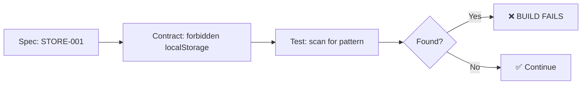
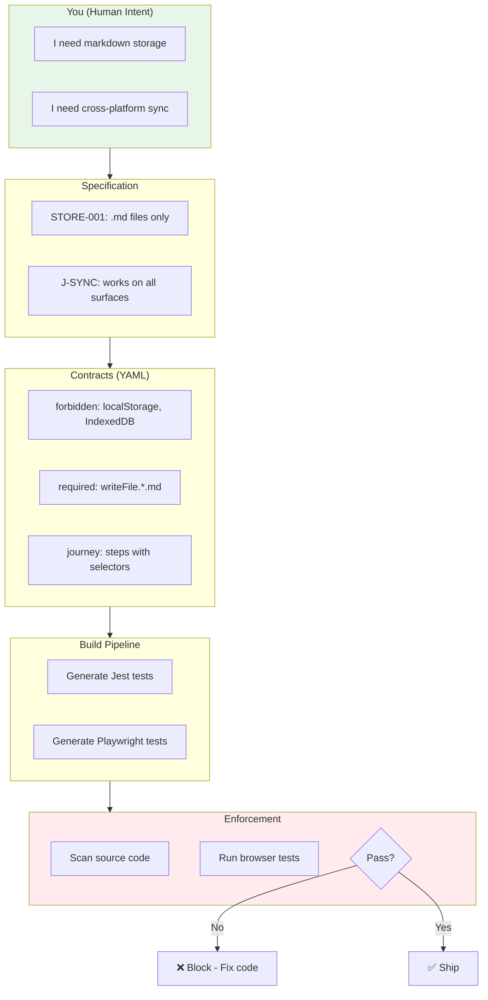
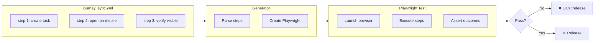
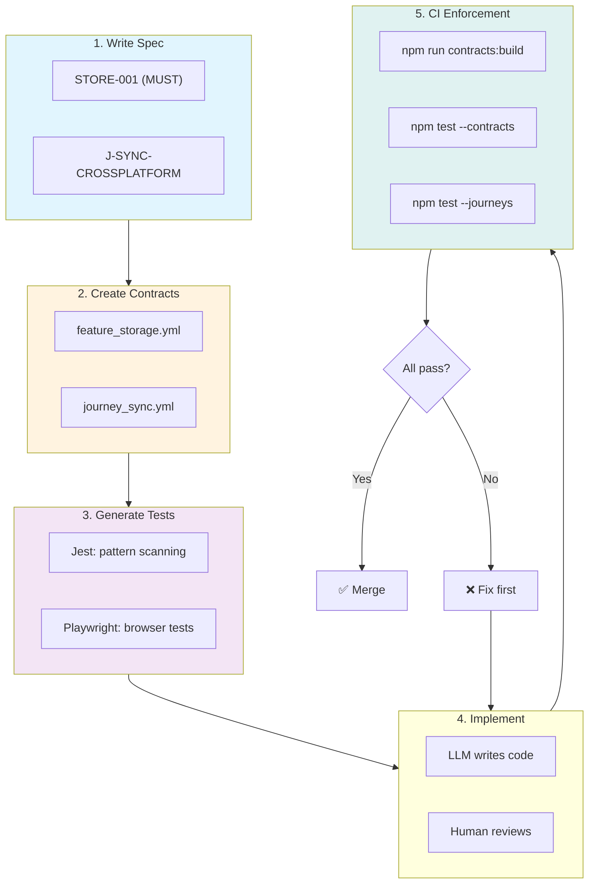
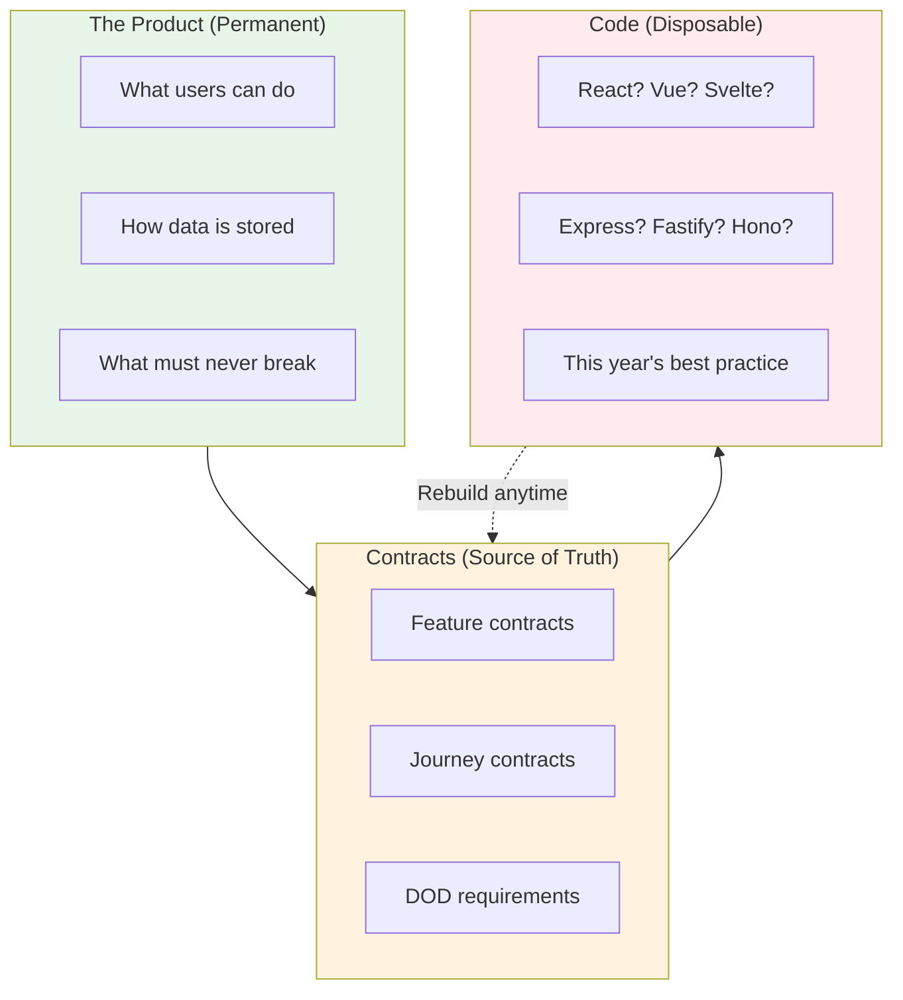

# Specflow: From Vibe Coding to Verified Code

## A Meetup Talk on Contract-Driven Development

---

## The Teenager Problem

Asking an LLM to build something is like asking a teenager to clean their room.

They'll do it. Enthusiastically, even.

But when you check:
- Clothes shoved under the bed
- "Organized" means one big pile
- The thing you actually needed? Can't find it.

**They completed the task. They didn't meet the intent.**

LLMs are the same. They're eager, capable, and confidently wrong about what you actually meant.

---

## The Attention Myth

Here's something most people don't realize:

> **LLMs don't read. They focus attention.**

That 50-page spec you wrote? The LLM isn't reading it like you do. It's running attention patterns across tokens, weighting what seems important *to the model*, not to you.

Your carefully written comment `// NEVER use localStorage here`?

Attention weight: ~0.02

The pattern it learned from 10,000 Stack Overflow answers using localStorage?

Attention weight: ~0.85

**Your intent loses. The pattern wins.**

---

## The Real Problem

You're building a todo app. You tell the LLM:

> "Store tasks in markdown files so they work everywhere"

It builds something. Tests pass. Ship it.

Three weeks later:
- Mobile can't read the files desktop created
- The CLI corrupts the web app's data
- The LLM "optimized" storage to IndexedDB

**Unit tests passed. Your intent was ignored.**

---

## Why Specs Fail

Traditional specs fail because they rely on:
- **Comments** → LLMs weight these low
- **Documentation** → Not in the attention window during coding
- **Conventions** → Overridden by training patterns
- **Human memory** → "I'm sure I mentioned this somewhere"

The spec exists. The LLM "read" it. But attention flowed elsewhere.

---

## The Specflow Insight

What if specs were **executable**?

Not prose that gets attention-weighted into oblivion.
But **patterns that fail the build**.

The LLM can't "attention" its way out of a failing build.

---

## Deterministic Intent

Specflow makes your intent **deterministic**:

| Before | After |
|--------|-------|
| "Please don't use localStorage" | `forbidden_pattern: /localStorage/` |
| "Make sure dates work everywhere" | `required_pattern: /toISOString/` |
| "Users need to sync across devices" | `journey: J-SYNC-CROSSPLATFORM, criticality: critical` |

Vague intent → Concrete rule → Automated test → Build gate

**No attention weights. No interpretation. Pass or fail.**

---

## The Contract Loop

Your intent flows through the entire pipeline, undiminished.

---

## Two Types of Contracts

| Type | What It Catches | How |
|------|-----------------|-----|
| **Feature Contracts** | Wrong implementation patterns | Regex scan of source code |
| **Journey Contracts** | Broken user flows | Playwright browser tests |

Both are generated from YAML. Both block the build.

---

## Feature Contracts: Pattern Enforcement

| REQ ID | Intent | Forbidden | Required |
|--------|--------|-----------|----------|
| STORE-001 | Markdown only | `localStorage`, `IndexedDB` | `writeFile.*\.md` |
| FORMAT-001 | Portable dates | `toLocaleString()` | `toISOString()` |
| SYNC-001 | No platform lock-in | `chrome.storage`, `AsyncStorage` | — |

When the LLM "optimizes" your storage to IndexedDB:
- Unit tests: ✅ Pass (it works!)
- Contract tests: ❌ `VIOLATION: STORE-001`

**The build fails. The teenager can't hide clothes under the bed.**

---

## Journey Contracts: User Flow Enforcement

Your Definition of Done isn't "code compiles." It's "users accomplish goals."

| Criticality | Meaning |
|-------------|---------|
| `critical` | Playwright tests MUST pass to release |
| `important` | Should fix before release |
| `future` | Can release without |

---

## The CLAUDE.md Bridge

Contracts work because they're **in the build**. But we can also tell the LLM about them.

Add to your project's `CLAUDE.md`:

> Before modifying code:
> 1. Read `docs/contracts/*.yml`
> 2. Check `compliance_checklist`
> 3. Run `npm test -- contracts`
>
> If you violate a `non_negotiable` rule, the build will fail.

This doesn't rely on attention weights. It sets expectations.

Even if the LLM ignores it, the build catches it.

---

## The Full Pipeline

---

## What Actually Gets Caught

| Scenario | Unit Tests | Contract Tests |
|----------|-----------|----------------|
| LLM uses IndexedDB instead of .md | ✅ Pass | ❌ `STORE-001` |
| LLM uses `toLocaleString()` for dates | ✅ Pass | ❌ `FORMAT-001` |
| LLM uses `chrome.storage` | ✅ Pass | ❌ `SYNC-001` |
| User flow breaks after refactor | ✅ Pass | ❌ Journey fails |

**The teenager did the task. The parent checked.**

---

## The Bigger Why: Code is Disposable

Here's the real unlock:

> **If your contracts are complete, you can rebuild your entire app from scratch.**

Keep your UI. Keep your database. Throw away all the code.

Hand the contracts to a new LLM, a new team, a new framework—and rebuild.

If it passes all contract tests and all journey tests, **it's the same product**.

---

## Code is an Abstraction

The product is **what users can accomplish**.

The contracts **encode that**.

The code is just **one way to make it happen**.

---

## Why This Matters

| Traditional | Contract-First |
|-------------|----------------|
| Code IS the product | Code IMPLEMENTS the product |
| Rewrite = Start over | Rewrite = Run tests until green |
| Framework lock-in | Framework freedom |
| "We can't change that, too risky" | "Rebuild it, contracts will catch issues" |
| Knowledge lives in developers' heads | Knowledge lives in contracts |

**Your contracts are your product specification, test suite, and documentation—all executable.**

---

## The Flow State

When Specflow is working, you get **flow**:

1. **Write what you mean** — Spec with REQ IDs
2. **Encode what you mean** — YAML contracts
3. **Generate enforcement** — Tests from YAML
4. **Code fearlessly** — LLM or human, doesn't matter
5. **Trust the build** — Violations caught automatically
6. **Rewrite fearlessly** — Contracts verify any implementation

No more:
- Re-reading your own comments hoping the LLM saw them
- Reviewing every line for "did it actually do what I asked?"
- Discovering in production that intent was lost
- **Fear of rewrites or framework migrations**

---

## Quick Start

**New project:**
1. Write spec with REQ IDs
2. Create contract YAML
3. Run `npm run contracts:build`
4. Add to `CLAUDE.md`
5. Add `npm test -- contracts` to CI

**Existing project:**
1. Document what works TODAY (plain English)
2. Convert to contracts
3. Now you can refactor without fear

---

## Key Takeaways

1. **LLMs don't read, they attend** — Your comments get low weight

2. **Intent must be executable** — If it's not in the build, it's optional

3. **Contracts are deterministic** — No interpretation, pass or fail

4. **Two enforcement layers** — Pattern scanning + Playwright journeys

5. **The build is the parent** — It checks if the room is actually clean

---

## The One Thing

> The LLM will always find a creative way to complete your task while missing your intent.

Specflow makes intent unforgettable.

---

## Citations & Further Reading

1. **"Attention Is All You Need"** — Vaswani et al., 2017
   - The transformer architecture paper. LLMs use attention mechanisms, not sequential reading.

2. **"Language Models are Few-Shot Learners"** — Brown et al., 2020 (GPT-3)
   - Demonstrates how models weight patterns from training over in-context instructions.

3. **"Lost in the Middle"** — Liu et al., 2023
   - Shows LLMs struggle to use information in the middle of long contexts. Your spec's important details? Probably in the middle.

4. **"Do Large Language Models Know What They Don't Know?"** — Yin et al., 2023
   - LLMs confidently produce outputs even when uncertain. They don't flag "I might be ignoring your requirements."

5. **Real-world incidents:**
   - TabStax temp ID isolation bug — Passed 69 tests, broke in production
   - localStorage in service workers — LLM "optimization" crashed MV3 extension
   - Date format sync failures — `toLocaleString()` broke cross-device sync

---

## Resources

- **Demo:** `cd Specflow/demo && npm run demo`
- **SPEC-FORMAT.md** — How to write specs with REQ IDs
- **CONTRACT-SCHEMA.md** — YAML contract format
- **LLM-MASTER-PROMPT.md** — Instructions for your LLM
- **USER-JOURNEY-CONTRACTS.md** — Definition of Done with Playwright

---

*"Asking an LLM to follow your spec is like asking a teenager to clean their room. They'll do it. Just not how you meant."*
